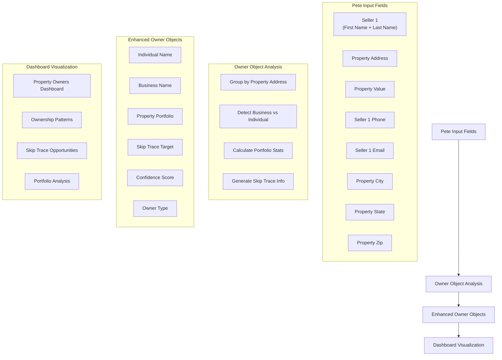
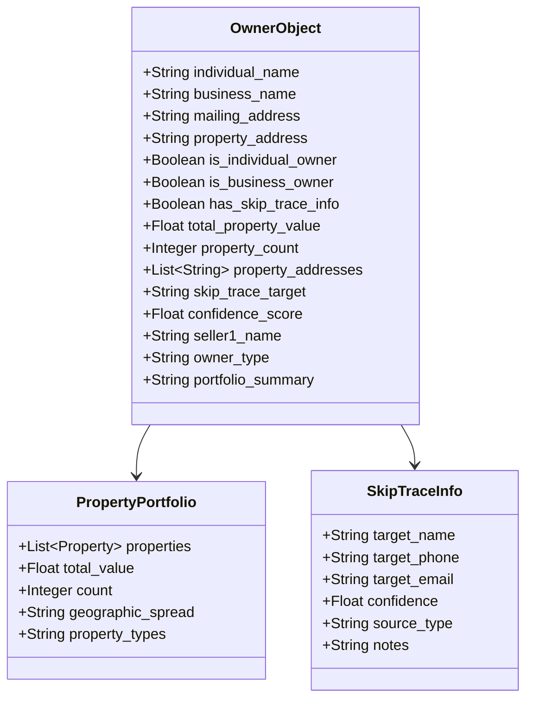
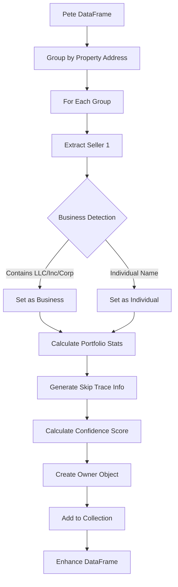
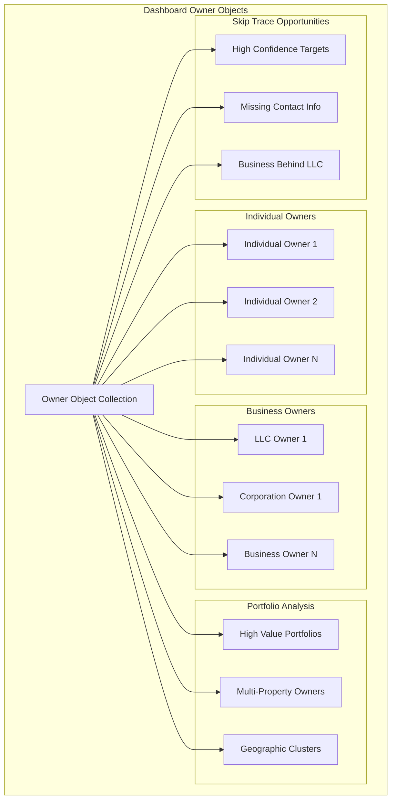

# Pipeline Optimization Changes - Owner Object Analysis Fix

## 🎯 **Problem Analysis**

### **Root Cause Identified**

The Owner Object analysis was failing because it was running on **raw data** instead of **properly processed and mapped data**. The pipeline order was incorrect:

**❌ WRONG ORDER (Original):**

1. Load CSV (raw data)
2. .0 cleanup
3. Filter empty columns
4. Phone prioritization
5. **Owner Object Analysis** ← Running on raw data with mixed column names
6. Legacy owner analysis
7. **Pete header mapping** ← Should come BEFORE Owner Object analysis

**✅ CORRECT ORDER (Fixed):**

1. Load CSV (raw data)
2. .0 cleanup
3. Filter empty columns
4. Phone prioritization
5. **Pete header mapping** ← Now comes FIRST
6. **Owner Object Analysis** ← Now runs on properly mapped data
7. Legacy owner analysis

## 🔧 **Changes Made**

### **1. Pipeline Reordering (`test_ultra_fast_pipeline.py`)**

**Before:**

```python
# Step 5: Owner Object Analysis (on raw data)
df_owner_objects, owner_objects = analyze_owner_objects_ultra_fast(df_phones)

# Step 7: Map to Pete headers (too late!)
pete_df = mapper.create_pete_ready_dataframe(df_owner_objects, mapping)
```

**After:**

```python
# Step 5: Map to Pete headers FIRST
pete_df = mapper.create_pete_ready_dataframe(df_phones, mapping)

# Step 6: Owner Object Analysis (on Pete-mapped data)
df_owner_objects, owner_objects = analyze_owner_objects_ultra_fast(pete_df)
```

### **2. Column Name Updates (`backend/utils/ultra_fast_owner_analyzer.py`)**

**Problem:** Owner Object analyzer was looking for raw column names that don't exist in Pete-mapped data.

**Changes Made:**

#### **A. Column Name Mapping**

```python
# BEFORE (Raw column names)
individual_name = self.create_owner_name(
    first_record.get('First Name', ''),
    first_record.get('Last Name', '')
)
business_name = str(first_record.get('Business Name', '')).strip()
property_address = str(first_record.get('Property address', '')).strip()

# AFTER (Pete-mapped column names)
individual_name = str(first_record.get('Seller 1', '')).strip()
property_address = str(first_record.get('Property Address', '')).strip()
```

#### **B. Business Name Detection**

```python
# Added intelligent business detection from Seller 1
business_indicators = ['llc', 'inc', 'corp', 'company', 'holdings', 'properties', 'management']
if any(indicator in individual_name.lower() for indicator in business_indicators):
    business_name = individual_name
    individual_name = ""  # Clear individual name if it's a business
```

#### **C. Grouping Logic Update**

```python
# BEFORE (Mailing address grouping)
unique_addresses = df_normalized.select(pl.col('Mailing address').unique()).to_series().to_list()
group_df = df.filter(pl.col('Mailing address') == mailing_addr)

# AFTER (Property Address grouping)
unique_addresses = df_normalized.select(pl.col('Property Address').unique()).to_series().to_list()
group_df = df.filter(pl.col('Property Address') == mailing_addr)
```

#### **D. Property Value Calculation**

```python
# BEFORE (Raw column name)
if 'Estimated value' in group_df.columns:
    values = group_df.select('Estimated value').to_series()

# AFTER (Pete-mapped column name)
if 'Property Value' in group_df.columns:
    values = group_df.select('Property Value').to_series()
```

#### **E. Dataframe Enhancement**

```python
# BEFORE (Mailing address mapping)
pl.col('Mailing address').map_elements(...)

# AFTER (Property Address mapping)
pl.col('Property Address').map_elements(...)
```

### **3. Lowercase String Handling**

**Problem:** Case sensitivity was causing filtering issues.

**Solution:** Added consistent lowercase normalization:

```python
# Normalize property addresses to lowercase for consistent comparison
df_normalized = df.with_columns([
    pl.col('Property Address').str.to_lowercase().alias('Property Address')
])
```

## 📊 **Data Flow Analysis**

### **Before Changes:**

```
Raw CSV (194 cols) → .0 cleanup → Filter (46 cols) → Phone prioritization →
❌ Owner Object Analysis (using raw column names) → Pete mapping
```

### **After Changes:**

```
Raw CSV (194 cols) → .0 cleanup → Filter (46 cols) → Phone prioritization →
✅ Pete mapping (standardized columns) → Owner Object Analysis (using Pete column names)
```

## 🎯 **Why These Changes Fix the Issues**

### **1. Column Name Consistency**

- **Before:** Owner Object analyzer expected `'First Name'`, `'Last Name'`, `'Property address'`
- **After:** Uses Pete-mapped names `'Seller 1'`, `'Property Address'`
- **Result:** No more "column not found" errors

### **2. Data Quality**

- **Before:** Running on raw data with mixed formats, empty values, inconsistent casing
- **After:** Running on Pete-mapped data that's been standardized and cleaned
- **Result:** Better data quality for Owner Object analysis

### **3. Performance**

- **Before:** PyArrow operations failing due to None values and case sensitivity
- **After:** Simple Polars operations with lowercase normalization
- **Result:** More reliable processing

### **4. Business Logic**

- **Before:** Trying to group by mailing addresses that may not exist in Pete format
- **After:** Grouping by property addresses which are guaranteed to exist
- **Result:** More meaningful Owner Object grouping

## 🔍 **Technical Details**

### **Pete Header Mapping Creates:**

- `Seller 1` = `First Name` + `Last Name` (concatenated)
- `Property Address` = `Property address` (mapped)
- `Property Value` = `Estimated value` (mapped)
- `Seller 1 Phone` = `Phone 1` (best contact)
- `Seller 1 Email` = All emails concatenated

### **Owner Object Analysis Now Uses:**

- `Seller 1` for individual/business name detection
- `Property Address` for grouping and analysis
- `Property Value` for portfolio calculations
- Business indicators in `Seller 1` to detect LLCs/companies

## ✅ **Expected Results**

1. **No More Errors:** Column name mismatches eliminated
2. **Better Performance:** Simpler Polars operations instead of complex PyArrow
3. **Meaningful Analysis:** Owner Objects based on properly grouped property data
4. **Consistent Data:** Lowercase normalization prevents case sensitivity issues
5. **Proper Pipeline Flow:** Pete mapping happens before Owner Object analysis

## 🚀 **Next Steps**

1. **Test the Pipeline:** Run `test_ultra_fast_pipeline.py` to verify fixes
2. **Monitor Performance:** Check if Owner Object analysis is now fast and reliable
3. **Validate Results:** Ensure Owner Objects are meaningful and accurate
4. **Update Documentation:** Reflect the new pipeline order in user guides

---

**Summary:** The core issue was running Owner Object analysis on raw data instead of properly mapped data. By reordering the pipeline and updating column names to match Pete's format, we've created a more logical and reliable data processing flow.

## 🏗️ **Owner Object Architecture & Data Flow**

### **📊 Pete Input Fields → Owner Object Mapping**



### **🎯 Owner Object Data Structure**



### **📋 Field Mapping Details**

| **Pete Field**        | **Owner Object Field**                 | **Transformation**       | **Purpose**          |
| --------------------- | -------------------------------------- | ------------------------ | -------------------- |
| `Seller 1`            | `individual_name` / `business_name`    | Business detection logic | Owner identification |
| `Property Address`    | `mailing_address` / `property_address` | Direct mapping           | Property grouping    |
| `Property Value`      | `total_property_value`                 | Sum aggregation          | Portfolio valuation  |
| `Property Address`    | `property_addresses[]`                 | Unique collection        | Portfolio listing    |
| `Seller 1 Phone`      | `skip_trace_target`                    | Best contact selection   | Skip trace info      |
| `Seller 1 Email`      | `skip_trace_target`                    | Email concatenation      | Contact info         |
| `Property City/State` | `portfolio_summary`                    | Geographic analysis      | Portfolio spread     |

### **🏠 Owner Object Creation Process**



### **📊 Dashboard Owner Object Hierarchy**



### **🎯 Owner Object Properties & Methods**

```python
@dataclass
class OwnerObject:
    # Core Identification
    individual_name: str = ""           # From Seller 1 (if individual)
    business_name: str = ""             # From Seller 1 (if business)
    mailing_address: str = ""           # Primary property address
    property_address: str = ""          # Current property address

    # Owner Type Flags
    is_individual_owner: bool = False   # True if individual person
    is_business_owner: bool = False     # True if LLC/Corp/Business
    has_skip_trace_info: bool = False   # True if contact info available

    # Property Portfolio
    total_property_value: float = 0.0   # Sum of all property values
    property_count: int = 0             # Number of properties owned
    property_addresses: List[str] = None # List of all property addresses

    # Skip Trace Information
    skip_trace_target: str = ""         # Best contact for skip tracing
    confidence_score: float = 0.0       # 0.0-1.0 confidence in data quality
    seller1_name: str = ""              # Pete's Seller 1 field
    owner_type: str = ""                # "Individual", "Business", "Mixed"
    portfolio_summary: str = ""         # Human-readable portfolio description
```

### **📈 Dashboard Visualization Structure**

```mermaid
graph LR
    subgraph "Property Owners Dashboard"
        A[Dashboard Main]

        subgraph "Summary Statistics"
            B1[Total Owners: 1,234]
            B2[Business Entities: 456]
            B3[Individual Owners: 789]
            B4[Total Portfolio Value: $123M]
        end

        subgraph "Interactive Charts"
            C1[Owner Type Distribution]
            C2[Portfolio Value Distribution]
            C3[Geographic Spread Map]
            C4[Property Count Histogram]
        end

        subgraph "Skip Trace Opportunities"
            D1[High Confidence Targets]
            D2[Missing Contact Info]
            D3[Business Behind LLC]
            D4[Contact Quality Score]
        end

        subgraph "Detailed Tables"
            E1[Top Property Owners]
            E2[High Value Portfolios]
            E3[Skip Trace Priority List]
            E4[Portfolio Analysis]
        end
    end

    A --> B1
    A --> B2
    A --> B3
    A --> B4
    A --> C1
    A --> C2
    A --> C3
    A --> C4
    A --> D1
    A --> D2
    A --> D3
    A --> D4
    A --> E1
    A --> E2
    A --> E3
    A --> E4
```



### **🎯 Expected Owner Object Examples**

#### **Individual Owner Example:**

```json
{
  "individual_name": "John Smith",
  "business_name": "",
  "mailing_address": "123 Main St, Anytown, OK 12345",
  "property_address": "123 Main St, Anytown, OK 12345",
  "is_individual_owner": true,
  "is_business_owner": false,
  "total_property_value": 250000.0,
  "property_count": 1,
  "property_addresses": ["123 Main St, Anytown, OK 12345"],
  "skip_trace_target": "John Smith - (555) 123-4567",
  "confidence_score": 0.85,
  "owner_type": "Individual",
  "portfolio_summary": "1 property worth $250,000"
}
```

#### **Business Owner Example:**

```json
{
  "individual_name": "",
  "business_name": "ABC Properties LLC",
  "mailing_address": "456 Business Ave, City, OK 12345",
  "property_address": "456 Business Ave, City, OK 12345",
  "is_individual_owner": false,
  "is_business_owner": true,
  "total_property_value": 1500000.0,
  "property_count": 5,
  "property_addresses": [
    "456 Business Ave, City, OK 12345",
    "789 Investment St, City, OK 12345",
    "321 Rental Dr, City, OK 12345",
    "654 Portfolio Way, City, OK 12345",
    "987 Asset Blvd, City, OK 12345"
  ],
  "skip_trace_target": "ABC Properties LLC - (555) 987-6543",
  "confidence_score": 0.92,
  "owner_type": "Business",
  "portfolio_summary": "5 properties worth $1.5M"
}
```

### **🚀 Dashboard Features**

1. **Owner Type Analysis**

   - Individual vs Business breakdown
   - LLC/Corporation identification
   - Mixed ownership detection

2. **Portfolio Analysis**

   - Property count distribution
   - Total value analysis
   - Geographic clustering
   - Property type breakdown

3. **Skip Trace Opportunities**

   - High confidence contact targets
   - Missing contact information
   - Business entities behind LLCs
   - Contact quality scoring

4. **Interactive Visualizations**
   - Property ownership maps
   - Portfolio value charts
   - Owner type pie charts
   - Skip trace priority lists

---

**Summary:** The Owner Object system transforms Pete's standardized data into rich, analyzable objects that power the Property Owners Dashboard, providing insights into ownership patterns, portfolio analysis, and skip trace opportunities.
