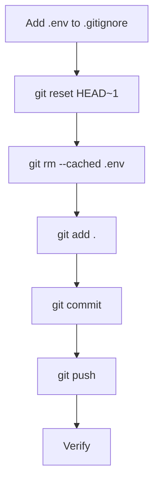

# 🛡️ Cleanup Secrets & Safe Push Plan (v1.0)

**Created:** 2025-08-02
**Author:** AI Agent

---

## 🎯 Goal & Scope

Remove the accidentally committed `.env` (and any other secrets) from the new commit, ensure it’s permanently ignored, and push a clean history to GitHub.

This is a _local_ history rewrite (only the last commit) — no published commits are affected because the push was blocked.

---

## ✅ Sequential Steps

- [ ] 1. Append `.env` (file) to `.gitignore` (it currently ignores only `.env/`).
- [ ] 2. Undo the previous commit while keeping changes in the working tree:
     `git reset --mixed HEAD~1`
- [ ] 3. Remove `.env` from the index & working tree:
     `git rm --cached .env`
- [ ] 4. Verify that stage is clean of `.env` (`git status`).
- [ ] 5. Add the rest of the files (`git add .`).
- [ ] 6. Commit with message `chore: snapshot without secrets; ignore .env`.
- [ ] 7. Push to remote (`git push`).
- [ ] 8. Confirm push accepted.
- [ ] 9. Mark plan complete.

---

## 🖥️ Mermaid Diagram

---

## 📋 Status

Current status: **Pending user approval**

---

## 📝 Changelog

- v1.0 – Draft plan to remove secrets and push clean history (2025-08-02)

---
