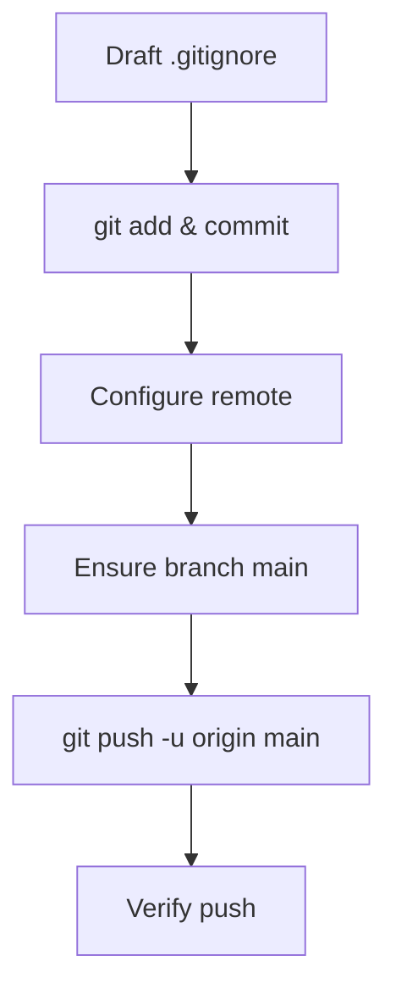

# 🚀 Git Remote & `.gitignore` Setup Plan (v1.1)

**Created:** 2025-08-02  **Updated:** 2025-08-02
**Author:** AI Agent

---

## 🎯 Goal & Scope

Craft and commit a project-specific `.gitignore`, configure the new GitHub remote, rename branch to `main`, push initial history, and verify remote linkage.

---

## ✅ Sequential Steps

- [x] 1. Draft the `.gitignore` content.
- [x] 2. Add the `.gitignore` file (`git add .gitignore`).
- [x] 3. Commit with message `chore: add project-specific .gitignore`.
- [x] 4. Set remote `origin` → `https://github.com/Mark0025/PeteDataCleaner.git`.
- [x] 5. Ensure branch is `main` (`git branch -M main`).
- [x] 6. Push to remote & set upstream (`git push -u origin main`).
- [x] 7. Verify remote push (`git remote show origin`).
- [x] 8. Update plan with results & mark complete.

---

## 🖥️ Mermaid Workflow Diagram

---

## 🔍 Execution Results

- `.gitignore` created with rules for Python artifacts, virtualenv, UV lock files, logs, datasets, IDE configs, etc.
- Commit `9913250 chore: add project-specific .gitignore` added to history.
- Remote `origin` now points to `https://github.com/Mark0025/PeteDataCleaner.git`.
- Branch `main` set and pushed; tracking established.
- Remote verification confirms `main` is up-to-date and tracking `origin/main`.

### GitHub Repo

Visit: <https://github.com/Mark0025/PeteDataCleaner>

---

## 📋 Status

Current status: **Completed** (v1.1 – all tasks executed successfully)

---

## 📝 Changelog

- v1.1 – Marked all steps complete & added results (2025-08-02)
- v1.0 – Initial plan drafted (2025-08-02)

---

## 🔍 Rationale

Repository is now properly isolated on GitHub with a clean ignore file, paving the way for safe collaborative development and CI/CD integration.
