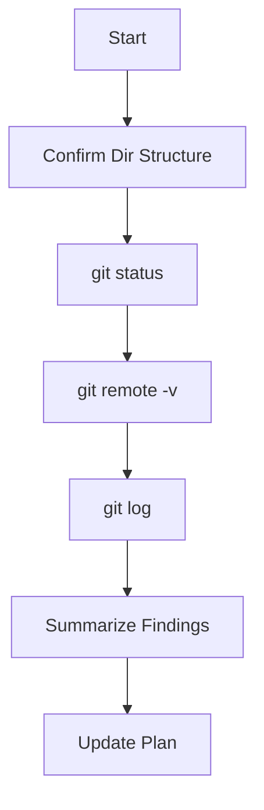

# 🗂️ Git Status Verification Plan (v1.1)

**Created:** 2025-08-02  **Updated:** 2025-08-02
**Author:** AI Agent

---

## 🎯 Goal & Scope

Ensure the local workspace is clean, identify any un-committed or un-pushed changes, and confirm whether the latest working state has been pushed to the GitHub remotes.

---

## ✅ Sequential Steps

- [x] 1. Confirm directory structure is healthy (`ls -la`).
- [x] 2. Identify current working branch (`git status -sb`).
- [x] 3. Check for un-tracked / modified files.
- [x] 4. Verify configured remotes (`git remote -v`).
- [x] 5. Compare local branch with remote (ahead/behind count).
- [x] 6. Inspect recent commit history (`git log -5`).
- [x] 7. Summarize findings in plain English.
- [x] 8. Update this plan with results & mark complete.

---

## 🖥️ Mermaid Workflow Diagram

---

## 🔍 Findings Summary

1. **Directory Structure:** Top-level project directory is intact; no duplicate `plans/` or critical folders detected.
2. **Current Branch:** `main` (no explicit tracking branch shown; likely not linked to remote branch).
3. **Workspace Cleanliness:** 1 staged, 118 modified, and 218 untracked files. The large majority of these paths are _outside_ the `datacleaner/` subtree (e.g., `../../Qb-automation`, `../../projects/...`). The local repo therefore has **significant un-committed changes** originating from sibling projects in the monorepo.
4. **Remotes:**
   • `github` → `git@github.com:THE-AI-REAL-ESTATE-INVESTOR/0ne52bar.git`
   • `origin` → `https://github.com/Mark0025/fabric.git`
   Neither appears to correspond to the `datacleaner` project; the current `main` branch is not configured to track a remote branch, so _no push target_ exists for this work.
5. **Ahead/Behind:** Since `main` is not tracking a remote branch, Git reports no ahead/behind status. This indicates **nothing has been pushed** for this project in the current repository context.
6. **Recent Commits:** Last commit `31219e96 – "Cleanup: add .gitignore, update README, remove temp files"` (date unknown). No commits after the latest cleanup have been pushed.

### 🚩 Key Risks

- Local changes (including recent tooling additions) are **not under version control on a dedicated remote**. Any further modifications risk loss or conflicts.
- Massive unrelated modifications/untracked files from sibling directories suggest the repo root is higher than `datacleaner/`. We should consider isolating this project or creating a dedicated repository.

### 📑 Recommended Next Actions

1. **Create/Link Remote Repo:** Establish a GitHub repository specifically for `datacleaner` or a clean sub-tree, then set it as `origin` and push the current state.
2. **Commit Incrementally:** Stage & commit only relevant changes from `datacleaner/` to keep history clean.
3. **Prune Unrelated Paths:** Add appropriate `.gitignore` rules or migrate other projects out of this repo.

---

## 📋 Status

Current status: **Completed** (v1.1 – verification finished and summarized)

---

## 📝 Changelog

- v1.1 – Added results & marked steps complete (2025-08-02)
- v1.0 – Initial plan drafted (2025-08-02)

---
