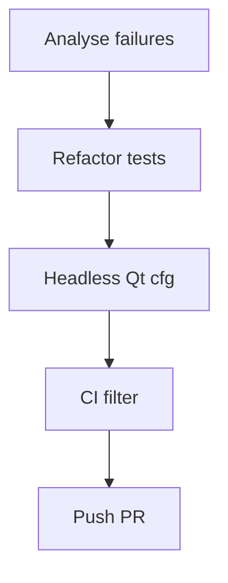

# 🧪 GUI Test Suite Stabilization Plan (v1.0)

**Created:** 2025-08-02
**Author:** AI Agent

---

## 🎯 Goal & Scope

Repair the failing PyQt integration tests and establish a reliable, headless-capable GUI test harness so CI remains green and future UI changes are caught automatically.

---

## ✅ Sequential Steps

- [ ] 1. Analyse current failures in `tests/test_gui_workflow.py` (widget timing / file paths).
- [ ] 2. Introduce `pytest-qt` fixtures (`qtbot`) instead of manual `QApplication` management.
- [ ] 3. Refactor the test into smaller units:
     • `test_startup_menu`
     • `test_file_selector`
     • `test_strip_dot_button`
     Each uses `qtbot.waitExposed` or `qtbot.waitSignal` for stability.
- [ ] 4. Add `QT_QPA_PLATFORM=offscreen` env in `pyproject.toml` test settings.
- [ ] 5. Mark heavy end-to-end test with `@pytest.mark.gui` so it can be optional.
- [ ] 6. Update CI config (GitHub Actions) to install Qt libs & run with `pytest -m "not gui"` by default.
- [ ] 7. Commit fixes + plan updates on branch `test/gui-suite-stabilization`.
- [ ] 8. Push branch & open PR linking this plan.

---

## 🖥️ Mermaid Diagram

---

## 📋 Status

Current status: **Pending user approval**

---

## 📝 Changelog

- v1.0 – Initial draft (2025-08-02)

---
