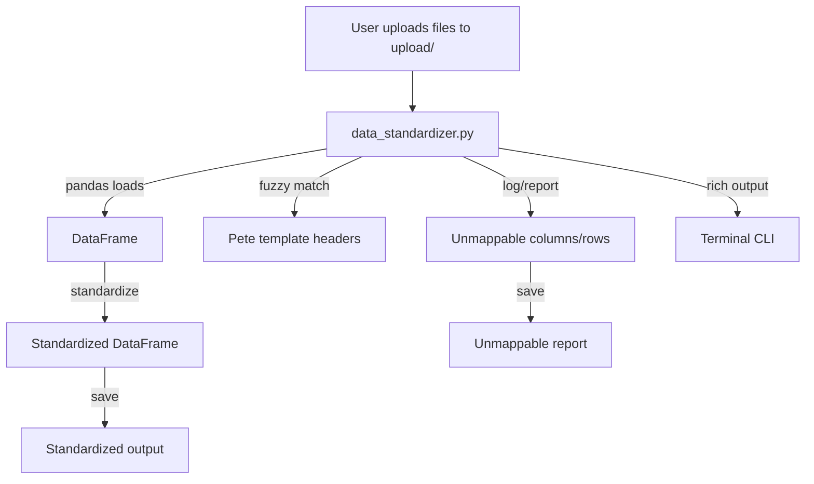

# Plan: Data Standardizer Utility

**Version:** v0.1.0

---

## Changelog

- v0.1.0: Initial plan for data standardizer utility (awaiting approval)

---

## Goal

Automate the ingestion and standardization of user-uploaded data files (CSV, Excel, etc.) to the Pete format using pandas and fuzzy column mapping. Provide a CLI with rich output, and log/report any unmappable data.

---

## Steps

- [x] Create `upload/` directory for user-uploaded files
- [ ] Store Pete template headers (from BarMinimumschema.json or similar)
- [ ] Implement `backend/data_standardizer.py`:
  - [ ] Scan `upload/` for files
  - [ ] Load each file with pandas (support CSV, Excel, etc.)
  - [ ] Fuzzy match columns to Pete template headers (use rapidfuzz/fuzzywuzzy)
  - [ ] Standardize data to Pete format (DataFrame with Pete headers)
  - [ ] Log/output any unmappable columns/rows
  - [ ] Save standardized data and unmappable report
  - [ ] Provide a CLI with rich output (using `rich` or similar)
  - [ ] Organize as a class with dunder methods for extensibility
- [ ] Optional: Interactive CLI for manual mapping if auto-mapping is ambiguous
- [ ] Document all progress and issues in `DEV_MAN/`
- [ ] Update this plan as work progresses

---

## Mermaid Diagram



```

---

## Status
- **Not Started**
- Awaiting approval

---

## Rationale
- Users provide data in many formats; standardization is essential for automation and analysis.
- Fuzzy matching and a rich CLI make the process robust and user-friendly.
- Logging/reporting unmappable data ensures nothing is lost and helps improve the mapping process over time.
```
