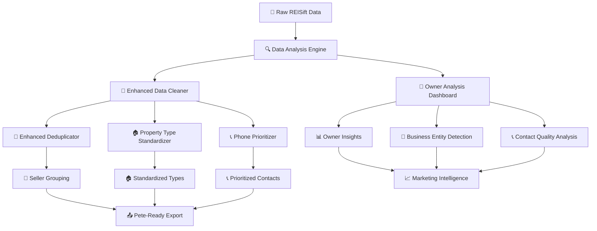

# Enhanced Data Cleaning & Owner Analysis System

**Version:** 1.0  
**Date:** 2025-08-09  
**Status:** Planning  
**Branch:** `feat/enhanced-data-cleaning-owner-analysis`

## 🎯 **Goal**

Transform Pete Data Cleaner into a comprehensive data analysis and standardization platform that provides deep insights into property ownership while delivering clean, Pete-ready data.

## 📊 **Current State Analysis**

### **Data Structure Understanding:**

- **REISift Data:** 30 phone fields, multiple email fields, property details
- **Pete Requirements:** 5 phone fields, contact objects (Seller 1-5), standardized property types
- **Owner Analysis:** Need to identify individual owners vs. business entities (LLCs, trusts, etc.)

### **Existing Utilities:**

- ✅ Phone Prioritizer (status, type, call history)
- ✅ Property Type Standardization (basic)
- ✅ Duplicate Removal Dialog
- ✅ Data Version Manager
- ✅ Pete Header Mapper

## 🏗️ **Architecture Overview**



## 🎯 **Feature Requirements**

### **1. Enhanced Deduplicator (UI Enhancement)**

**Location:** `frontend/dialogs/duplicate_removal_dialog.py`

**New Options:**

- [ ] **Address-Based Deduplication:** Group by Property Address
- [ ] **Seller Grouping:** Create Seller 1,2,3,4,5 from address duplicates
- [ ] **Full Duplicate Removal:** Remove identical rows completely
- [ ] **Phone Prioritization Integration:** Apply phone prioritizer to each seller group

**UI Changes:**

```
Duplicate Detection Method:
☑️ All Columns (existing)
☑️ Selected Columns (existing)
☑️ Case-Insensitive (existing)
🆕 Address-Based Grouping (NEW)
🆕 Smart Seller Creation (NEW)
```

### **2. Property Type Standardization (Auto + UI)**

**Location:** `backend/utils/data_standardizer_enhanced.py` + new UI dialog

**Auto-Standardization on Upload:**

- [ ] **Pre-upload Analysis:** Show what will be standardized
- [ ] **Confirmation Dialog:** User approves standardization rules
- [ ] **Custom Rules:** UI to define grouping rules

**Standardization Rules:**

```python
SINGLE_FAMILY_GROUP = [
    'single family', 'single family residence', 'sfr',
    'single family residential', 'single family home'
]

DUPLEX_GROUP = [
    'duplex', 'duplex (2 units, any combination)',
    'two unit', '2 unit'
]

MOBILE_GROUP = [
    'mobile/manufactured home', 'mobile home',
    'manufactured home', 'trailer'
]
```

### **3. Owner Analysis Dashboard (New Feature)**

**Location:** `frontend/components/owner_analysis_dashboard.py`

**Core Features:**

- [ ] **Owner Index:** All unique owners by mailing address
- [ ] **Property Portfolio:** Properties owned by each person/entity
- [ ] **Business Entity Detection:** LLC, Trust, Bank-owned identification
- [ ] **Contact Quality:** Phone status analysis per owner
- [ ] **Pete Export Status:** Track what's been exported to Pete

**Data Structure:**

```python
OwnerRecord = {
    'owner_id': str,
    'mailing_address': str,
    'owner_name': str,  # concatenated First Name + Last Name
    'entity_type': str,  # 'individual', 'llc', 'trust', 'bank'
    'properties': List[PropertyRecord],
    'contact_quality': ContactQualityScore,
    'pete_export_status': 'not_exported' | 'exported' | 'in_progress'
}
```

### **4. Smart Seller Creation Engine**

**Location:** `backend/utils/smart_seller_creator.py`

**Logic:**

```python
def create_seller_groups(df: pd.DataFrame) -> pd.DataFrame:
    """
    1. Group by Property Address
    2. For each group:
       - If identical rows → DEDUPE
       - If different sellers → CREATE Seller 1,2,3,4,5
       - Apply phone prioritization to each seller
    3. Return Pete-ready DataFrame
    """
```

## 🛠️ **Implementation Plan**

### **Phase 1: Enhanced Deduplicator**

1. **Analyze current duplicate removal dialog**
2. **Add address-based grouping options**
3. **Integrate phone prioritizer**
4. **Test with sample data**

### **Phase 2: Property Type Standardization**

1. **Enhance data_standardizer_enhanced.py**
2. **Create standardization preview dialog**
3. **Add auto-standardization on upload**
4. **Test standardization rules**

### **Phase 3: Owner Analysis Dashboard**

1. **Create owner analysis engine**
2. **Build dashboard UI**
3. **Implement business entity detection**
4. **Add Pete export tracking**

### **Phase 4: Smart Seller Creation**

1. **Build seller grouping logic**
2. **Integrate with phone prioritizer**
3. **Create Pete-ready export**
4. **Test end-to-end workflow**

## 📁 **File Structure**

```
backend/utils/
├── smart_seller_creator.py          # NEW: Seller grouping logic
├── owner_analysis_engine.py         # NEW: Owner analysis
├── business_entity_detector.py      # NEW: LLC/Trust detection
├── data_standardizer_enhanced.py    # ENHANCED: Property type rules
└── pete_export_tracker.py          # NEW: Export status tracking

frontend/components/
├── owner_analysis_dashboard.py      # NEW: Owner dashboard UI
└── standardization_preview_dialog.py # NEW: Standardization preview

frontend/dialogs/
└── duplicate_removal_dialog.py      # ENHANCED: Address-based options
```

## 🎯 **Success Metrics**

### **Data Quality:**

- [ ] 100% property type standardization
- [ ] Zero full duplicates in Pete exports
- [ ] Optimal phone prioritization per seller

### **Owner Insights:**

- [ ] Complete owner portfolio analysis
- [ ] Accurate business entity detection
- [ ] Contact quality scoring

### **Pete Integration:**

- [ ] Clean, standardized exports
- [ ] Export status tracking
- [ ] Seller 1-5 creation from address duplicates

## 🔄 **Workflow Integration**

### **Data Upload Flow:**

```
1. Upload REISift data
2. Auto-analyze property types → Show standardization preview
3. User confirms standardization rules
4. Apply standardization
5. Show owner analysis dashboard
6. User reviews owner insights
7. Apply enhanced deduplication (address-based)
8. Create Pete-ready export
```

### **Owner Analysis Flow:**

```
1. Index all owners by mailing address
2. Detect business entities (LLC, Trust, etc.)
3. Analyze contact quality per owner
4. Show property portfolio per owner
5. Track Pete export status
6. Generate marketing intelligence
```

## 🚀 **Next Steps**

1. **Create Phase 1 plan** (Enhanced Deduplicator)
2. **Analyze current duplicate removal dialog**
3. **Design address-based grouping UI**
4. **Implement phone prioritizer integration**
5. **Test with sample data**

---

**Changelog:**

- v1.0: Initial plan creation with comprehensive feature requirements
