# Fix Data Storage Architecture

**Status:** 🔴 Planning  
**Version:** 1.0  
**Created:** 2025-08-09  
**Priority:** 🔥 CRITICAL

## Problem

The application is incorrectly storing processed data in `DEV_MAN/property_owners/` which is meant for documentation and development management, not application data storage.

## Goal

Move all application data to proper data directories and update the codebase to use correct paths.

## Architecture Fix

```mermaid
graph TD
    A[Current: DEV_MAN/property_owners/] --> B[❌ WRONG - Dev docs]
    C[Should be: data/] --> D[✅ CORRECT - App data]

    D --> E[data/processed/]
    D --> F[data/raw/]
    D --> G[data/exports/]
    D --> H[data/backups/]

    E --> I[owner_objects/]
    E --> J[enhanced_data/]
    E --> K[reports/]
```

## Steps

- [ ] **1. Create proper data directory structure**

  - [ ] Create `data/` directory in project root
  - [ ] Create subdirectories: `processed/`, `raw/`, `exports/`, `backups/`
  - [ ] Create `data/processed/owner_objects/` for owner analysis results
  - [ ] Create `data/processed/enhanced_data/` for cleaned datasets
  - [ ] Create `data/processed/reports/` for analysis reports

- [ ] **2. Move existing data**

  - [ ] Move `DEV_MAN/property_owners/owner_objects/` → `data/processed/owner_objects/`
  - [ ] Move `DEV_MAN/property_owners/enhanced_data/` → `data/processed/enhanced_data/`
  - [ ] Move `DEV_MAN/property_owners/reports/` → `data/processed/reports/`
  - [ ] Move `DEV_MAN/property_owners/backups/` → `data/backups/`

- [ ] **3. Update codebase paths**

  - [ ] Find all references to `DEV_MAN/property_owners/` in code
  - [ ] Update `owner_persistence_manager.py` to use new paths
  - [ ] Update any other files that reference the old paths
  - [ ] Update configuration files if needed

- [ ] **4. Update .gitignore**

  - [ ] Add `data/` to .gitignore (except for sample data)
  - [ ] Remove `DEV_MAN/property_owners/` from .gitignore if present

- [ ] **5. Test the changes**

  - [ ] Run a test pipeline to ensure data saves to new locations
  - [ ] Verify all existing functionality still works
  - [ ] Check that DEV_MAN is now clean of app data

- [ ] **6. Documentation**
  - [ ] Update README with new data directory structure
  - [ ] Document the data flow and storage locations

## Rationale

- **Separation of Concerns:** DEV_MAN is for development documentation, not app data
- **Scalability:** Proper data directory structure supports growth
- **Maintainability:** Clear separation makes the codebase easier to understand
- **Best Practices:** Follows standard project structure conventions

## Changelog

- **v1.0:** Initial plan to fix data storage architecture
