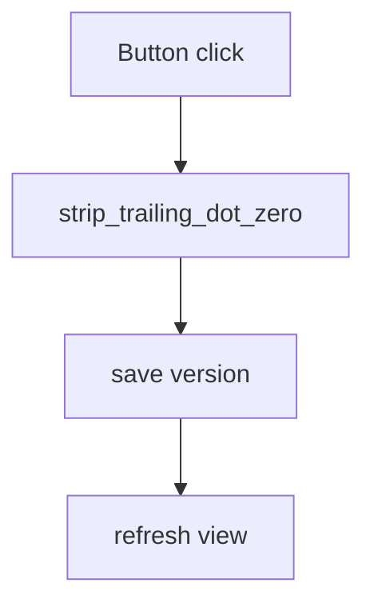

# 🖱️ Strip .0 Button Integration Plan (v1.0)

**Created:** 2025-08-02
**Author:** AI Agent

---

## 🎯 Goal & Scope
Expose the trailing-dot cleanup utility in the GUI so users can click a button in *Data Tools → Content Tools* to strip `.0` from numeric-string columns before mapping/export.

---

## ✅ Sequential Steps
- [ ] 1. Add import `from backend.utils import trailing_dot_cleanup as tdc` in `frontend/toolsui/data_tools_panel.py`.
- [ ] 2. Insert a new button "🚫 Strip .0" in the *Content Tools* group.
- [ ] 3. Implement method `_strip_trailing_dot`:
      • Fetch current DataFrame via `self.data_prep_editor.get_prepared_data()`.
      • Call `tdc.clean_dataframe(df)`.
      • Save new version with `self.data_prep_editor.version_manager.save_version(...)`.
      • Refresh view and show `QMessageBox` summarising cleaned columns.
- [ ] 4. Add unit test in `tests/test_gui_workflow.py` that simulates button click and asserts cleaned data (headless PyQt).
- [ ] 5. Commit on branch `feat/strip-dot-button`.
- [ ] 6. Push branch & open PR referencing this plan.

---

## 🖥️ Mermaid Diagram

---

## 📋 Status
Current status: **Pending user approval**

---

## 📝 Changelog
- v1.0 – Initial draft (2025-08-02)

---