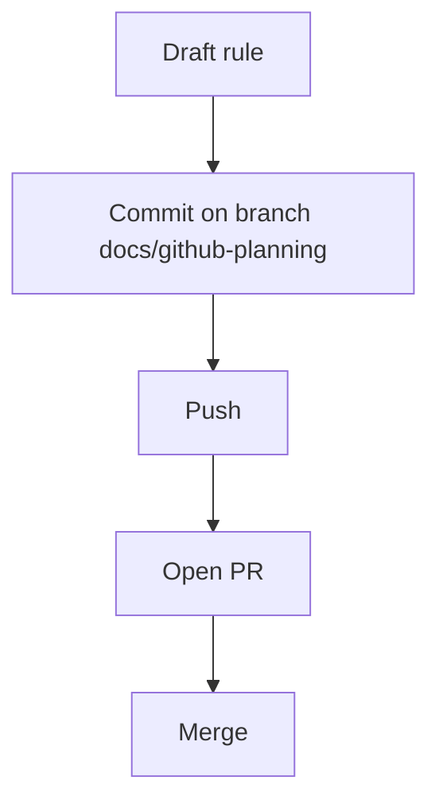

# 📋 GitHub Planning Workflow Rule Plan (v1.0)

**Created:** 2025-08-02
**Author:** AI Agent

---

## 🎯 Goal & Scope

Define and codify project-wide best practices for using GitHub Issues, Projects, branches and PRs. The rule will live in `.cursor/rules/github_planning.mdc` and will guide all future tasks.

---

## ✅ Sequential Steps

- [ ] 1. Draft rule file `.cursor/rules/github_planning.mdc` covering:
     • Issue templates / labels
     • Branch naming (`type/short-description`)
     • PR checklist (tests, lint, plan reference)
     • Project board usage
     • Secret-scan & CI gating reminders
- [ ] 2. Save rule file locally.
- [ ] 3. Create branch `docs/github-planning`.
- [ ] 4. Commit rule file + this plan update.
- [ ] 5. Push branch & open PR on GitHub.
- [ ] 6. After review, merge & move this plan to `plans/completed/`.

---

## 🖥️ Mermaid Diagram

---

## 📋 Status

Current status: **Pending user approval**

---

## 📝 Changelog

- v1.0 – Initial draft (2025-08-02)

---
