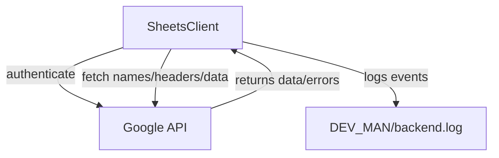

# Plan: Logging and Backend Google Sheets Client

**Version:** v0.2.0

---

## Changelog

- v0.1.0: Initial plan drafted (logging and backend scaffolding)
- v0.2.0: Added plan for Google Sheets API integration, authentication, and real data access

---

## Why This Version (v0.2.0)?

- The backend client is scaffolded, but real Google Sheets API integration is required for all downstream features (UI, analysis, automation).
- This step will enable live data access, unlock end-to-end workflows, and allow for robust error/logging.

---

## Steps

- [x] Create `backend/` directory if it does not exist.
- [x] Add `backend/sheets_client.py` for Google Sheets API access (scaffolded)
- [x] Add logging to all backend scripts using `loguru`
- [ ] **Google Sheets API Integration:**
  - [ ] Install and configure `gspread` and `oauth2client` if not already present
  - [ ] Authenticate using `client_secret.json` and `token.pickle`
  - [ ] Implement real API calls in `SheetsClient`:
    - [ ] Set and use variable sheet ID
    - [ ] List sheet/tab names
    - [ ] Fetch headers (first row)
    - [ ] Fetch all data as records
  - [ ] Log all API calls, errors, and results to `DEV_MAN/backend.log`
  - [ ] Test connection and data retrieval with a known Google Sheet
  - [ ] Document any issues or blockers in `DEV_MAN/`
- [ ] Update this plan and mark completed steps

---

## Mermaid Diagram



```

---

## Status
- **In Progress: Google Sheets API integration and testing**

---

## Rationale
- Real API integration is required for all user-facing and automation features.
- Logging and error handling are critical for debugging and future extensibility.
- This step is a prerequisite for UI, analysis, and end-to-end workflows.
```
