# 📞 Phone Number Enhancement Utility Plan

**Created:** 2025-01-31 07:35:00  
**Version:** v1.0  
**Status:** 🟡 Planning Phase

---

## 🎯 Goal and Scope

### Problem Statement

Phone numbers are coming in as `float64` with `.0` suffixes (e.g., `4053052196.0`) and need:

1. **Data Cleaning**: Remove `.0` and convert to proper phone format
2. **Smart Prioritization**: Phones marked as "correct number" should be prioritized
3. **Dynamic Allocation**: Move correct phones up to Phone 1, Phone 2, etc. based on status

### Success Criteria

- [x] Clean phone numbers from float64 to proper string format
- [x] Implement phone status-based prioritization system
- [x] Create modular utility following existing architecture patterns
- [x] Integration with existing data prep workflow
- [x] Maintain backwards compatibility with current data structures

---

## 🏗️ Architecture Integration

### Current System Analysis

From `LATEST_REPORT.md`, the existing modular structure:

- **Backend Utils**: `data_standardizer.py` (196 LOC), `data_type_converter.py` (154 LOC)
- **Frontend Components**: Data prep editor with concatenation patterns
- **Existing Phone Patterns**: Found in concatenation logic

### New Component Placement

```
backend/utils/
├── data_standardizer.py     # Existing - 196 LOC
├── data_type_converter.py   # Existing - 154 LOC
└── phone_processor.py       # 🆕 NEW - Phone cleaning & prioritization
```

---

## 📋 Sequential Implementation Steps

### Phase 1: Core Phone Processing Utility

- [ ] **1.1** Create `backend/utils/phone_processor.py`
  - [ ] Phone number cleaning (remove .0, format validation)
  - [ ] Status-based prioritization logic
  - [ ] Phone allocation reordering engine
  - [ ] Integration with existing loguru logging

### Phase 2: Status Detection & Validation

- [ ] **2.1** Implement status detection patterns
  - [ ] "correct number" keyword detection
  - [ ] Status tag parsing (if structured data)
  - [ ] Confidence scoring for phone validity
  - [ ] Integration with existing data validation patterns

### Phase 3: Prioritization Engine

- [ ] **3.1** Phone ranking algorithm
  - [ ] Weight correct numbers higher (priority score)
  - [ ] Handle multiple correct phones per record
  - [ ] Reorder Phone 1, Phone 2, Phone 3 columns dynamically
  - [ ] Maintain original data integrity

### Phase 4: Data Prep Integration

- [ ] **4.1** Enhance existing data prep workflow
  - [ ] Add phone processing to data standardizer
  - [ ] Update concatenation dialog for phone merging
  - [ ] Add phone preview in data prep editor
  - [ ] Follow existing BaseComponent patterns

### Phase 5: Testing & Validation

- [ ] **5.1** Unit tests for phone processing
- [ ] **5.2** Integration tests with data prep workflow
- [ ] **5.3** Sample data validation with current upload patterns

---

## 🔧 Technical Implementation Details

### Phone Processor Class Structure

```python
class PhoneProcessor:
    """
    Utility for cleaning and prioritizing phone numbers based on status.

    Features:
    - Clean float64 phone numbers (remove .0)
    - Parse phone status indicators
    - Prioritize "correct number" entries
    - Reorder phone columns by priority
    """

    def clean_phone_number(self, phone_value) -> str
    def detect_phone_status(self, record_data) -> Dict[str, float]
    def prioritize_phones(self, phone_columns, status_data) -> List[str]
    def reorder_phone_allocation(self, df) -> pd.DataFrame
```

### Status Detection Patterns

```python
STATUS_PATTERNS = {
    'correct_number': ['correct', 'valid', 'confirmed', 'verified'],
    'incorrect_number': ['incorrect', 'invalid', 'wrong', 'bad'],
    'unverified': ['unverified', 'unknown', 'pending']
}
```

### Integration Points

1. **DataStandardizer**: Add phone processing step
2. **DataTypeConverter**: Enhanced phone-specific conversion
3. **Data Prep Editor**: Phone preview and manual override
4. **Concatenation Dialog**: Smart phone merging

---

## 🎨 User Experience Flow

```mermaid
graph TD
    A["📁 Upload Data<br/>Phone columns as float64"]
    B["🧹 Phone Processor<br/>• Clean .0 suffixes<br/>• Detect status tags<br/>• Calculate priorities"]
    C["📊 Smart Allocation<br/>• Rank by correctness<br/>• Reorder Phone 1,2,3<br/>• Show confidence scores"]
    D["✅ Data Prep Preview<br/>• Review phone allocation<br/>• Manual override option<br/>• Export clean data"]

    A --> B
    B --> C
    C --> D

    style A fill:#e3f2fd
    style B fill:#c8e6c9
    style C fill:#fff3e0
    style D fill:#f3e5f5
```



### Key UX Improvements

- **Auto-Detection**: Automatically identify and clean phone columns
- **Visual Feedback**: Show priority scores and allocation logic
- **Manual Override**: Allow users to adjust phone ranking
- **Batch Processing**: Handle multiple records efficiently

---

## 📊 Sample Data Scenarios

### Before (Current State)

```
Phone 1: 4053052196.0    Status: ""
Phone 2: 4052555529.0    Status: "incorrect"
Phone 3: 4053783205.0    Status: "correct number"
```

### After (Enhanced Processing)

```
Phone 1: 4053783205      Status: "correct number" [Priority: 1.0]
Phone 2: 4053052196      Status: "" [Priority: 0.5]
Phone 3: 4052555529      Status: "incorrect" [Priority: 0.1]
```

---

## 🔗 Integration with Existing Components

### Backend Integration

- **DataStandardizer**: Add phone processing step in `propose_mapping()`
- **DataTypeConverter**: Enhance with phone-specific cleaning methods
- **Sheets Integration**: Handle phone columns in Pete template mapping

### Frontend Integration

- **Data Prep Editor**: Add phone processing preview
- **Concatenation Dialog**: Smart phone merging with status awareness
- **Mapping UI**: Show phone priority indicators

---

## 📝 Implementation Notes

### Modular Design Principles

1. **Single Responsibility**: Each method handles one aspect of phone processing
2. **Dependency Injection**: Pass configuration and status patterns as parameters
3. **Error Handling**: Graceful degradation for malformed phone data
4. **Logging**: Comprehensive logging with loguru for debugging

### Backwards Compatibility

- Existing phone columns remain unchanged if no status data
- Optional phone processing - can be disabled
- Fallback to original data if processing fails

### Performance Considerations

- Batch processing for large datasets
- Efficient pandas operations
- Memory-conscious status detection

---

## 🚀 Future Enhancements (Phase 6+)

### Advanced Features

- [ ] **Machine Learning**: Phone validity prediction
- [ ] **International Format**: Support for international phone numbers
- [ ] **Duplicate Detection**: Identify duplicate phones across columns
- [ ] **Confidence Scoring**: Advanced scoring algorithms
- [ ] **User Learning**: Remember user phone prioritization preferences

### Analytics Integration

- [ ] **Quality Metrics**: Track phone data quality improvements
- [ ] **Status Tracking**: Monitor phone validation accuracy
- [ ] **Performance Analytics**: Processing time and efficiency metrics

---

## 📋 Changelog

### Version 1.0 (2025-01-31)

- **Added**: Initial plan structure
- **Added**: Phone cleaning and prioritization requirements
- **Added**: Integration strategy with existing codebase
- **Added**: Technical implementation details
- **Rationale**: User reported phone numbers with .0 suffixes needing priority-based allocation

---

## ✅ Ready for Implementation

This plan provides a comprehensive roadmap for enhancing phone number handling while maintaining the existing modular architecture. The solution addresses the specific .0 suffix issue and adds intelligent phone prioritization based on status indicators.

**Next Step**: Await user approval to begin Phase 1 implementation.
