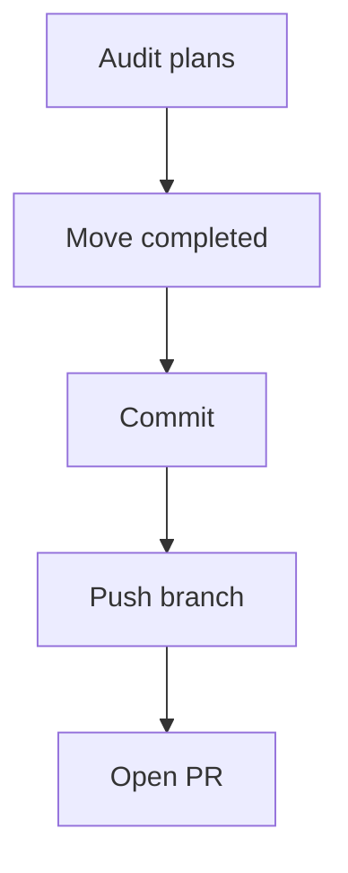

# 🗄️ Plan Housekeeping & Workflow Standardization (v1.0)

**Created:** 2025-08-02
**Author:** AI Agent

---

## 🎯 Goal & Scope

1. Audit all plan files in `DEV_MAN/plans/current/`.
2. Move any plans marked **Completed** to `DEV_MAN/plans/completed/` using news-feed style (newest on top).
3. Confirm directory hygiene (no duplicate `plans/` directories).
4. Commit & push housekeeping changes on a dedicated branch with PR.

---

## ✅ Sequential Steps

- [ ] 1. List every plan file in `plans/current/` and determine status.
- [ ] 2. Create `plans/completed/` folder if missing.
- [ ] 3. Move completed plans (`git_status_verification.md`, `git_remote_and_gitignore_setup.md`, `cleanup_secrets_and_push.md`) to `plans/completed/`.
- [ ] 4. Commit with message `chore(plans): archive completed plans`.
- [ ] 5. Push branch `chore/plan-housekeeping` & open PR.
- [ ] 6. Merge after tests (no code impact expected).

---

## 🖥️ Mermaid Diagram

---

## 📋 Status

Current status: **Pending user approval**

---

## 📝 Changelog

- v1.0 – Initial draft (2025-08-02)

---
