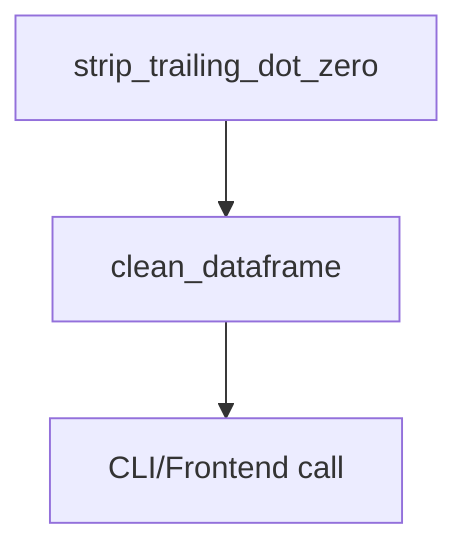

# 📞🛠️ Trailing `.0` Cleanup Utility Plan (v1.0)

**Created:** 2025-08-02
**Author:** AI Agent

---

## 🎯 Goal & Scope

Develop a backend utility that:

1. Cleans phone-number columns by stripping trailing `.0` (already handled by `PhoneProcessor.clean_phone_number` but expose as a standalone helper).
2. Extends the same logic to _any_ string/float column in a `DataFrame` where values end with `.0` but should be treated as integers/strings (e.g., zip codes, parcel numbers).
3. Provides CLI entry-point and can be invoked from frontend `toolsui` for one-click cleanup.

---

## ✅ Sequential Steps

- [ ] 1. Review existing `PhoneProcessor.clean_phone_number` implementation.
- [ ] 2. Create new backend util `backend/utils/trailing_dot_cleanup.py` with:
     • `strip_trailing_dot_zero(value: Any) -> str`
     • `clean_dataframe(df: pd.DataFrame, columns: Optional[List[str]]=None) -> pd.DataFrame`
- [ ] 3. Write pytest covering edge cases (int-like floats, pure strings, NaNs).
- [ ] 4. Integrate into `toolsui/DataToolsPanel` as a button “Strip .0” (future PR).
- [ ] 5. Commit on feature branch `feat/trailing-dot-cleanup`.
- [ ] 6. Push branch & open PR; run tests.
- [ ] 7. Merge after review.

---

## 🖥️ Mermaid Diagram

---

## 📋 Status

Current status: **Pending user approval**

---

## 📝 Changelog

- v1.0 – Initial plan draft (2025-08-02)

---
