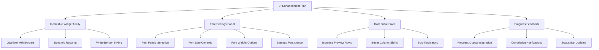

# 🎨 UI Enhancements and Fixes Plan

## 📋 **Goal**
Fix data table display issues, add resizable widgets with borders, and implement font settings for better user experience.

## 🔍 **Current Issues**
1. **Data Table**: Only showing 10 rows (appears as 1 property)
2. **Widget Resizing**: No dynamic resizing with borders
3. **Font Settings**: No font configuration options
4. **UI Feedback**: Incomplete progress feedback

## 🎯 **Solution Architecture**



## 📝 **Implementation Steps**

### **Phase 1: Resizable Widget Utility** ✅
- [ ] Create `frontend/utils/resizable_widget.py`
- [ ] Implement `ResizableWidget` class with QSplitter
- [ ] Add white border styling
- [ ] Make it reusable across the application

### **Phase 2: Font Settings Panel** ✅
- [ ] Create `frontend/dialogs/font_settings_dialog.py`
- [ ] Add font family, size, weight controls
- [ ] Integrate with settings persistence
- [ ] Apply fonts globally

### **Phase 3: Data Table Fixes** ✅
- [ ] Increase default preview rows from 10 to 50
- [ ] Add scroll indicators
- [ ] Improve column sizing
- [ ] Add row count display

### **Phase 4: Progress Feedback** ✅
- [ ] Integrate ProgressDialog in long operations
- [ ] Add completion notifications
- [ ] Improve status bar updates

## 🛠️ **Technical Implementation**

### **Resizable Widget Utility**
```python
class ResizableWidget(QWidget):
    """Reusable resizable widget with borders."""
    
    def __init__(self, left_widget, right_widget, parent=None):
        # QSplitter with white borders
        # Dynamic resizing
        # Reusable across app
```

### **Font Settings Integration**
```python
class FontSettingsDialog(QDialog):
    """Font configuration dialog."""
    
    def __init__(self, parent=None):
        # Font family dropdown
        # Size controls
        # Weight options
        # Preview area
```

### **Data Table Enhancements**
```python
# Increase preview rows
preview_rows = min(rules.get('preview_row_count', 50), len(df))

# Add scroll indicators
self.table_widget.setVerticalScrollBarPolicy(Qt.ScrollBarAsNeeded)
```

## 📊 **Success Metrics**
- [ ] Data table shows 50+ rows by default
- [ ] All tool panels are resizable with borders
- [ ] Font settings are configurable and persistent
- [ ] Progress feedback is clear and informative

## 🔄 **Version History**
- **v1.0**: Initial plan creation
- **v1.1**: Added technical implementation details
- **v1.2**: Updated with current status assessment

## 📅 **Timeline**
- **Phase 1**: 30 minutes
- **Phase 2**: 45 minutes  
- **Phase 3**: 30 minutes
- **Phase 4**: 30 minutes
- **Total**: ~2.5 hours

## 🎯 **Next Steps**
1. Create resizable widget utility
2. Implement font settings dialog
3. Fix data table display
4. Integrate progress feedback
5. Test all enhancements 