```mermaid
graph TD
    DEV_MAN_rules_fetcher_auto_update_descriptions["DEV_MAN\nrules_fetcher\nauto_update_descriptions.py<br/>Utility"]
    style DEV_MAN_rules_fetcher_auto_update_descriptions fill:#feca57
    DEV_MAN_rules_fetcher_compare_rules["DEV_MAN\nrules_fetcher\ncompare_rules.py<br/>Utility"]
    style DEV_MAN_rules_fetcher_compare_rules fill:#feca57
    DEV_MAN_rules_fetcher_fetch_and_save_rules["DEV_MAN\nrules_fetcher\nfetch_and_save_rules.py<br/>Utility"]
    style DEV_MAN_rules_fetcher_fetch_and_save_rules fill:#feca57
    DEV_MAN_rules_fetcher_fetch_rule["DEV_MAN\nrules_fetcher\nfetch_rule.py<br/>Utility"]
    style DEV_MAN_rules_fetcher_fetch_rule fill:#feca57
    DEV_MAN_rules_fetcher_fetch_rule_gh["DEV_MAN\nrules_fetcher\nfetch_rule_gh.py<br/>Backend"]
    style DEV_MAN_rules_fetcher_fetch_rule_gh fill:#ff6b6b
    DEV_MAN_rules_fetcher_move_approved_rules["DEV_MAN\nrules_fetcher\nmove_approved_rules.py<br/>Utility"]
    style DEV_MAN_rules_fetcher_move_approved_rules fill:#feca57
    DEV_MAN_rules_fetcher_readme_parser["DEV_MAN\nrules_fetcher\nreadme_parser.py<br/>Backend"]
    style DEV_MAN_rules_fetcher_readme_parser fill:#ff6b6b
    DEV_MAN_rules_fetcher_standardize_rules["DEV_MAN\nrules_fetcher\nstandardize_rules.py<br/>Utility"]
    style DEV_MAN_rules_fetcher_standardize_rules fill:#feca57
    backend_data_standardizer["backend\ndata_standardizer.py<br/>Backend"]
    style backend_data_standardizer fill:#ff6b6b
    backend_header_mapper["backend\nheader_mapper.py<br/>Backend"]
    style backend_header_mapper fill:#ff6b6b
    backend_sheets_client["backend\nsheets_client.py<br/>Backend"]
    style backend_sheets_client fill:#ff6b6b
    backend_sheets_workspace_cli["backend\nsheets_workspace_cli.py<br/>Backend"]
    style backend_sheets_workspace_cli fill:#ff6b6b
    backend_utils_data_standardizer["backend\nutils\ndata_standardizer.py<br/>Backend"]
    style backend_utils_data_standardizer fill:#ff6b6b
    backend_utils_data_type_converter["backend\nutils\ndata_type_converter.py<br/>Backend"]
    style backend_utils_data_type_converter fill:#ff6b6b
    backend_utils_frontend_analyzer["backend\nutils\nfrontend_analyzer.py<br/>Backend"]
    style backend_utils_frontend_analyzer fill:#ff6b6b
    backend_utils_whatsworking["backend\nutils\nwhatsworking.py<br/>Backend"]
    style backend_utils_whatsworking fill:#ff6b6b
    cli["cli.py<br/>CLI"]
    style cli fill:#45b7d1
    frontend__deprecated_gui_mapping_tool["frontend\n_deprecated_gui_mapping_tool.py<br/>Frontend"]
    style frontend__deprecated_gui_mapping_tool fill:#4ecdc4
    frontend_components_base_component["frontend\ncomponents\nbase_component.py<br/>Frontend"]
    style frontend_components_base_component fill:#4ecdc4
    frontend_components_file_selector["frontend\ncomponents\nfile_selector.py<br/>Frontend"]
    style frontend_components_file_selector fill:#4ecdc4
    DEV_MAN_rules_fetcher_fetch_and_save_rules --> DEV_MAN_rules_fetcher_readme_parser
```

# 🔍 What's Working - Codebase Analysis Report

**Generated:** 2025-07-31 06:26:56
**Analyzed:** 42 Python files
**Total Lines of Code:** 4,747

---

## 📊 Summary Statistics

- **Files:** 42
- **Functions:** 235
- **Classes:** 32
- **Average LOC/File:** 113.0

### Files by Role:

- **Backend:** 12 files
- **CLI:** 3 files
- **Frontend:** 17 files
- **Test:** 1 files
- **Utility:** 9 files

---

## 🏗️ Architecture Overview

---

## 🧮 Most Complex Files

| File | Complexity Score |
|------|------------------|
| `frontend/_deprecated_gui_mapping_tool.py` | 569 |
| `backend/utils/whatsworking.py` | 118 |
| `backend/utils/frontend_analyzer.py` | 103 |
| `frontend/components/mapping_ui.py` | 99 |
| `frontend/main_window.py` | 82 |

---

## 🔗 Most Connected Files

| File | Import Count |
|------|--------------|
| `backend/utils/data_standardizer.py` | 11 |
| `frontend/_deprecated_gui_mapping_tool.py` | 9 |
| `backend/sheets_client.py` | 8 |
| `backend/utils/frontend_analyzer.py` | 8 |
| `backend/utils/whatsworking.py` | 8 |

---

## 📋 Detailed File Analysis

### Backend Files (12)

#### 📄 `DEV_MAN/rules_fetcher/fetch_rule_gh.py`
**Lines:** 66 | **Complexity:** 20
- **External Imports:** loguru, os, pandas, requests, subprocess
- **Functions:** get_repo_file_list, find_rule_paths, fetch_and_save_rule, main
- **Special:** 🚪 Entry Point

#### 📄 `DEV_MAN/rules_fetcher/readme_parser.py`
**Lines:** 51 | **Complexity:** 13
- **External Imports:** loguru, lxml, markdown, requests
- **Functions:** download_readme, parse_rules_from_readme, get_rule_links

#### 📄 `backend/__init__.py`
**Lines:** 0 | **Complexity:** 0
- **Special:** 📦 Init File

#### 📄 `backend/data_standardizer.py`
**Lines:** 13 | **Complexity:** 3
- **External Imports:** typing
- **Classes:** DataStandardizer
- **Functions:** __init__

#### 📄 `backend/header_mapper.py`
**Lines:** 59 | **Complexity:** 26
- **External Imports:** click, json, os, rapidfuzz, rich
- **Local Imports:** backend
- **Functions:** map_headers

#### 📄 `backend/sheets_client.py`
**Lines:** 173 | **Complexity:** 58
- **External Imports:** datetime, gspread, json, loguru, oauth2client, os, pickle, typing
- **Classes:** SheetsClient
- **Functions:** __init__, _authenticate, set_sheet_id, _get_spreadsheet, get_sheet_names (+8 more)
- **Decorators:** staticmethod

#### 📄 `backend/sheets_workspace_cli.py`
**Lines:** 117 | **Complexity:** 54
- **External Imports:** click, google, googleapiclient, json, os, rich
- **Local Imports:** backend
- **Functions:** cli, list, search, add, select (+1 more)

#### 📄 `backend/utils/__init__.py`
**Lines:** 0 | **Complexity:** 0
- **Special:** 📦 Init File

#### 📄 `backend/utils/data_standardizer.py`
**Lines:** 196 | **Complexity:** 58
- **External Imports:** datetime, json, loguru, numpy, os, pandas, rapidfuzz, re, rich, typing
- **Local Imports:** backend
- **Classes:** DataStandardizer
- **Functions:** __init__, load_pete_headers_from_sheet, load_upload_file, load_rules, propose_mapping (+2 more)
- **Decorators:** staticmethod

#### 📄 `backend/utils/data_type_converter.py`
**Lines:** 154 | **Complexity:** 35
- **External Imports:** loguru, numpy, pandas, typing
- **Classes:** DataTypeConverter
- **Functions:** infer_type, convert_column, convert_dataframe, filter_empty_columns, suggest_column_types (+1 more)
- **Decorators:** staticmethod

#### 📄 `backend/utils/frontend_analyzer.py`
**Lines:** 343 | **Complexity:** 103
- **External Imports:** ast, collections, dataclasses, datetime, json, os, pathlib, typing
- **Classes:** ComponentAnalysis, FrontendAnalyzer
- **Functions:** main, __init__, analyze_component, _classify_component_type, analyze_frontend (+2 more)
- **Special:** 🚪 Entry Point

#### 📄 `backend/utils/whatsworking.py`
**Lines:** 419 | **Complexity:** 118
- **External Imports:** ast, collections, dataclasses, datetime, json, os, pathlib, typing
- **Classes:** FileAnalysis, CodebaseAnalyzer
- **Functions:** main, __init__, get_all_py_files, analyze_file, _classify_role (+5 more)
- **Special:** 🚪 Entry Point

### CLI Files (3)

#### 📄 `DEV_MAN/hello.py`
**Lines:** 4 | **Complexity:** 1
- **Functions:** main
- **Special:** 🚪 Entry Point

#### 📄 `cli.py`
**Lines:** 63 | **Complexity:** 6
- **External Imports:** click, os, rich, subprocess, sys
- **Functions:** cli, workspace, standardize
- **Decorators:** pass_context

#### 📄 `hello.py`
**Lines:** 4 | **Complexity:** 1
- **Functions:** main
- **Special:** 🚪 Entry Point

### Frontend Files (17)

#### 📄 `frontend/__init__.py`
**Lines:** 2 | **Complexity:** 0
- **Local Imports:** main_window
- **Special:** 📦 Init File

#### 📄 `frontend/_deprecated_gui_mapping_tool.py`
**Lines:** 1084 | **Complexity:** 569
- **External Imports:** PyQt5, loguru, os, pandas, re, shutil, sys, typing
- **Local Imports:** backend
- **Classes:** SettingsDialog, StartupMenu, FileSelector, RuleMappingDialog, ConcatenationDialog, MappingTableWidget, ConcatenationDialog, RenameColumnDialog, MappingUI, StandardizedPreviewUI, MainWindow, WorkspaceDialog
- **Functions:** create_logo_label, __init__, save, __init__, handle_select (+54 more)

#### 📄 `frontend/components/__init__.py`
**Lines:** 23 | **Complexity:** 0
- **Local Imports:** base_component, file_selector, mapping_table_widget, mapping_ui, standardized_preview_ui, startup_menu
- **Special:** 📦 Init File

#### 📄 `frontend/components/base_component.py`
**Lines:** 51 | **Complexity:** 22
- **External Imports:** PyQt5
- **Local Imports:** frontend
- **Classes:** BaseComponent
- **Functions:** __init__, _add_navigation_buttons, _handle_back, _handle_exit

#### 📄 `frontend/components/file_selector.py`
**Lines:** 185 | **Complexity:** 77
- **External Imports:** PyQt5, loguru, os, pandas, shutil, typing
- **Local Imports:** backend, frontend
- **Classes:** FileSelector
- **Functions:** __init__, _setup_ui, refresh_file_list, on_file_selected, upload_new_csv (+4 more)

#### 📄 `frontend/components/mapping_table_widget.py`
**Lines:** 99 | **Complexity:** 47
- **External Imports:** PyQt5, typing
- **Local Imports:** frontend
- **Classes:** MappingTableWidget
- **Functions:** __init__, set_pete_headers, mousePressEvent, show_context_menu, open_concatenation_dialog (+3 more)

#### 📄 `frontend/components/mapping_ui.py`
**Lines:** 234 | **Complexity:** 99
- **External Imports:** PyQt5, pandas, typing
- **Local Imports:** backend, frontend
- **Classes:** MappingUI
- **Functions:** __init__, _setup_ui, toggle_headers, update_mapping_table, _setup_upload_view (+8 more)

#### 📄 `frontend/components/standardized_preview_ui.py`
**Lines:** 151 | **Complexity:** 63
- **External Imports:** PyQt5, pandas, typing
- **Local Imports:** frontend
- **Classes:** StandardizedPreviewUI
- **Functions:** __init__, _setup_ui, _setup_preview_table, _setup_download_buttons, download_csv (+3 more)

#### 📄 `frontend/components/startup_menu.py`
**Lines:** 55 | **Complexity:** 23
- **External Imports:** PyQt5, typing
- **Local Imports:** frontend
- **Classes:** StartupMenu
- **Functions:** __init__, _setup_ui, handle_select, update_options

#### 📄 `frontend/constants.py`
**Lines:** 27 | **Complexity:** 0
- **External Imports:** os

#### 📄 `frontend/dialogs/__init__.py`
**Lines:** 19 | **Complexity:** 0
- **Local Imports:** concatenation_dialog, rename_column_dialog, rule_mapping_dialog, settings_dialog
- **Special:** 📦 Init File

#### 📄 `frontend/dialogs/concatenation_dialog.py`
**Lines:** 106 | **Complexity:** 58
- **External Imports:** PyQt5, typing
- **Classes:** ConcatenationDialog
- **Functions:** __init__, _setup_ui, _setup_source_selection, _setup_separator_input, _setup_destination_selection (+2 more)

#### 📄 `frontend/dialogs/rename_column_dialog.py`
**Lines:** 73 | **Complexity:** 41
- **External Imports:** PyQt5
- **Classes:** RenameColumnDialog
- **Functions:** __init__, _setup_ui, validate_and_accept, get_new_name

#### 📄 `frontend/dialogs/rule_mapping_dialog.py`
**Lines:** 160 | **Complexity:** 78
- **External Imports:** PyQt5, typing
- **Classes:** RuleMappingDialog
- **Functions:** __init__, _setup_ui, _setup_never_map_tab, _setup_explicit_map_tab, _setup_concatenation_tab (+2 more)

#### 📄 `frontend/dialogs/settings_dialog.py`
**Lines:** 113 | **Complexity:** 75
- **External Imports:** PyQt5, typing
- **Classes:** SettingsDialog
- **Functions:** __init__, _setup_ui, _setup_mapping_settings, _setup_empty_column_settings, _setup_menu_options (+1 more)

#### 📄 `frontend/main_window.py`
**Lines:** 194 | **Complexity:** 82
- **External Imports:** PyQt5, loguru, os, pandas, sys
- **Local Imports:** backend, frontend
- **Classes:** MainWindow
- **Functions:** main, __init__, _setup_ui, clear_layout, show_startup_menu (+9 more)
- **Special:** 🚪 Entry Point | 🧪 Has Tests

#### 📄 `frontend/utils/logo_utils.py`
**Lines:** 21 | **Complexity:** 5
- **External Imports:** PyQt5
- **Local Imports:** frontend
- **Functions:** create_logo_label

### Test Files (1)

#### 📄 `tests/test_gui_workflow.py`
**Lines:** 56 | **Complexity:** 36
- **External Imports:** PyQt5, os, pandas, sys, unittest
- **Local Imports:** backend, frontend
- **Classes:** TestGUIMappingWorkflow
- **Functions:** setUpClass, test_startup_menu_exists, test_file_selector_navigation, test_file_upload_and_preview, test_mapping_workflow (+1 more)
- **Decorators:** classmethod
- **Special:** 🧪 Has Tests

### Utility Files (9)

#### 📄 `DEV_MAN/rules_fetcher/auto_update_descriptions.py`
**Lines:** 89 | **Complexity:** 19
- **External Imports:** loguru, os, re
- **Functions:** infer_globs, update_description_and_globs, main
- **Special:** 🚪 Entry Point

#### 📄 `DEV_MAN/rules_fetcher/compare_rules.py`
**Lines:** 52 | **Complexity:** 16
- **External Imports:** collections, loguru, os
- **Functions:** read_rule_file, extract_key_points, compare_rules

#### 📄 `DEV_MAN/rules_fetcher/fetch_and_save_rules.py`
**Lines:** 32 | **Complexity:** 5
- **External Imports:** loguru, os, requests
- **Local Imports:** readme_parser
- **Functions:** fetch_and_save_rule, main
- **Special:** 🚪 Entry Point

#### 📄 `DEV_MAN/rules_fetcher/fetch_rule.py`
**Lines:** 35 | **Complexity:** 6
- **External Imports:** loguru, os, requests, sys
- **Functions:** fetch_rule

#### 📄 `DEV_MAN/rules_fetcher/move_approved_rules.py`
**Lines:** 93 | **Complexity:** 16
- **External Imports:** loguru, os, shutil, subprocess
- **Functions:** prompt_mode, prompt_approve, prompt_overwrite, preview_rule, move_rule (+1 more)
- **Special:** 🚪 Entry Point

#### 📄 `DEV_MAN/rules_fetcher/standardize_rules.py`
**Lines:** 46 | **Complexity:** 13
- **External Imports:** loguru, os
- **Functions:** has_modern_header, standardize_rule_file, main
- **Special:** 🚪 Entry Point

#### 📄 `config.py`
**Lines:** 7 | **Complexity:** 0

#### 📄 `run_gas_function.py`
**Lines:** 30 | **Complexity:** 8
- **External Imports:** dotenv, googleapiclient, os, pickle, sys
- **Local Imports:** config
- **Functions:** get_credentials, run_function

#### 📄 `update_gas.py`
**Lines:** 48 | **Complexity:** 10
- **External Imports:** dotenv, google_auth_oauthlib, googleapiclient, os, pickle
- **Local Imports:** config
- **Functions:** get_credentials, update_script

---

## 🔄 Dependency Relationships

- `DEV_MAN/rules_fetcher/fetch_and_save_rules.py` depends on: `DEV_MAN/rules_fetcher/readme_parser.py`
- `frontend/__init__.py` depends on: `frontend/main_window.py`
- `frontend/components/__init__.py` depends on: `frontend/components/startup_menu.py`, `frontend/components/file_selector.py`, `frontend/components/standardized_preview_ui.py`, `frontend/components/mapping_table_widget.py`, `frontend/components/base_component.py`, `frontend/components/mapping_ui.py`
- `frontend/dialogs/__init__.py` depends on: `frontend/dialogs/settings_dialog.py`, `frontend/dialogs/concatenation_dialog.py`, `frontend/dialogs/rule_mapping_dialog.py`, `frontend/dialogs/rename_column_dialog.py`
- `run_gas_function.py` depends on: `config.py`
- `update_gas.py` depends on: `config.py`

---

**Report generated by:** `backend/utils/whatsworking.py`
**Timestamp:** 2025-07-31 06:26:56
