# 🔍 What's Working - Codebase Analysis Report

**Generated:** 2025-07-31 06:32:14
**Analyzed:** 42 Python files
**Total Lines of Code:** 4,917

---

## 📊 Summary Statistics

- **Files:** 42
- **Functions:** 243
- **Classes:** 33
- **Average LOC/File:** 117.1

### Files by Role:

- **Backend:** 12 files
- **CLI:** 3 files
- **Frontend:** 17 files
- **Test:** 1 files
- **Utility:** 9 files

---

## 🏗️ Architecture Overview

```mermaid
graph TB
    subgraph "🎯 Pete Codebase Architecture"
        subgraph "📊 📊 Development Tools (10 files)"
            node_0["hello.py<br/>📄 CLI<br/>📊 4 LOC"]
            node_1["auto_update_descriptions.py<br/>📄 Utility<br/>📊 89 LOC"]
            node_2["compare_rules.py<br/>📄 Utility<br/>📊 52 LOC"]
            node_3["fetch_and_save_rules.py<br/>📄 Utility<br/>📊 32 LOC"]
            node_4["fetch_rule.py<br/>📄 Utility<br/>📊 35 LOC"]
            node_5["fetch_rule_gh.py<br/>📄 Backend<br/>📊 66 LOC"]
            node_6["move_approved_rules.py<br/>📄 Utility<br/>📊 93 LOC"]
            node_7["readme_parser.py<br/>📄 Backend<br/>📊 51 LOC"]
            node_8["standardize_rules.py<br/>📄 Utility<br/>📊 46 LOC"]
            node_9["test_gui_workflow.py<br/>🧪 Test<br/>📊 56 LOC"]
        end
        subgraph "🔧 🔧 Backend (5 files)"
            node_10["__init__.py<br/>📄 Backend<br/>📊 0 LOC"]
            node_11["data_standardizer.py<br/>🔄 Backend<br/>📊 13 LOC"]
            node_12["header_mapper.py<br/>📄 Backend<br/>📊 59 LOC"]
            node_13["sheets_client.py<br/>📡 Backend<br/>📊 173 LOC"]
            node_14["sheets_workspace_cli.py<br/>🚪 Backend<br/>📊 117 LOC"]
        end
        subgraph "⚙️ Backend Utils (5 files)"
            node_15["__init__.py<br/>📄 Backend<br/>📊 0 LOC"]
            node_16["data_standardizer.py<br/>🔄 Backend<br/>📊 196 LOC"]
            node_17["data_type_converter.py<br/>📄 Backend<br/>📊 154 LOC"]
            node_18["frontend_analyzer.py<br/>📊 Backend<br/>📊 343 LOC"]
            node_19["whatsworking.py<br/>📄 Backend<br/>📊 589 LOC"]
        end
        subgraph "🚪 🚪 Entry Points (2 files)"
            node_20["cli.py<br/>🚪 CLI<br/>📊 63 LOC"]
            node_21["config.py<br/>⚙️ Utility<br/>📊 7 LOC"]
        end
        subgraph "🎨 🎨 Frontend (4 files)"
            node_22["__init__.py<br/>📄 Frontend<br/>📊 2 LOC"]
            node_23["_deprecated_gui_mapping_tool.py<br/>🗺️ Frontend<br/>📊 1084 LOC"]
            node_24["constants.py<br/>📄 Frontend<br/>📊 27 LOC"]
            node_25["main_window.py<br/>🖼️ Frontend<br/>📊 194 LOC"]
        end
        subgraph "🧩 Components (7 files)"
            node_26["__init__.py<br/>📄 Frontend<br/>📊 23 LOC"]
            node_27["base_component.py<br/>📦 Frontend<br/>📊 51 LOC"]
            node_28["file_selector.py<br/>📄 Frontend<br/>📊 185 LOC"]
            node_29["mapping_table_widget.py<br/>🗺️ Frontend<br/>📊 99 LOC"]
            node_30["mapping_ui.py<br/>🗺️ Frontend<br/>📊 234 LOC"]
            node_31["standardized_preview_ui.py<br/>📄 Frontend<br/>📊 151 LOC"]
            node_32["startup_menu.py<br/>📄 Frontend<br/>📊 55 LOC"]
        end
        subgraph "🔧 Dialogs (5 files)"
            node_33["__init__.py<br/>📄 Frontend<br/>📊 19 LOC"]
            node_34["concatenation_dialog.py<br/>💬 Frontend<br/>📊 106 LOC"]
            node_35["rename_column_dialog.py<br/>💬 Frontend<br/>📊 73 LOC"]
            node_36["rule_mapping_dialog.py<br/>🗺️ Frontend<br/>📊 160 LOC"]
            node_37["settings_dialog.py<br/>⚙️ Frontend<br/>📊 113 LOC"]
        end
        subgraph "🛠️ Frontend Utils (1 files)"
            node_38["logo_utils.py<br/>🛠️ Frontend<br/>📊 21 LOC"]
        end
        subgraph "📁 Other (3 files)"
            node_39["hello.py<br/>📄 CLI<br/>📊 4 LOC"]
            node_40["run_gas_function.py<br/>📄 Utility<br/>📊 30 LOC"]
            node_41["update_gas.py<br/>📄 Utility<br/>📊 48 LOC"]
        end
    end

    %% Key relationships
    node_1 --> node_2
    node_3 --> node_7
    node_12 --> node_10
    node_14 --> node_0
    node_14 --> node_10
    node_16 --> node_10
    node_16 --> node_2
    node_19 --> node_2
    node_22 --> node_25
    node_23 --> node_10
    node_23 --> node_2
    node_26 --> node_28
    node_26 --> node_29
    node_26 --> node_30
    node_26 --> node_27
    node_26 --> node_32
    node_26 --> node_31
    node_27 --> node_18
    node_28 --> node_10
    node_28 --> node_18

    %% Styling
    style node_0 fill:#96ceb4
    style node_1 fill:#96ceb4
    style node_2 fill:#96ceb4
    style node_3 fill:#96ceb4
    style node_4 fill:#96ceb4
    style node_5 fill:#96ceb4
    style node_6 fill:#96ceb4
    style node_7 fill:#96ceb4
    style node_8 fill:#96ceb4
    style node_9 fill:#96ceb4
    style node_10 fill:#ff6b6b
    style node_11 fill:#ff6b6b
    style node_12 fill:#ff6b6b
    style node_13 fill:#ff6b6b
    style node_14 fill:#ff6b6b
    style node_15 fill:#ff6b6b
    style node_16 fill:#ff6b6b
    style node_17 fill:#ff6b6b
    style node_18 fill:#ff6b6b
    style node_19 fill:#ff6b6b
    style node_20 fill:#45b7d1
    style node_21 fill:#45b7d1
    style node_22 fill:#4ecdc4
    style node_23 fill:#4ecdc4
    style node_24 fill:#4ecdc4
    style node_25 fill:#4ecdc4
    style node_26 fill:#4ecdc4
    style node_27 fill:#4ecdc4
    style node_28 fill:#4ecdc4
    style node_29 fill:#4ecdc4
    style node_30 fill:#4ecdc4
    style node_31 fill:#4ecdc4
    style node_32 fill:#4ecdc4
    style node_33 fill:#4ecdc4
    style node_34 fill:#4ecdc4
    style node_35 fill:#4ecdc4
    style node_36 fill:#4ecdc4
    style node_37 fill:#4ecdc4
    style node_38 fill:#4ecdc4
```

---

## 🧮 Most Complex Files

| File | Complexity Score |
|------|------------------|
| `frontend/_deprecated_gui_mapping_tool.py` | 569 |
| `backend/utils/whatsworking.py` | 165 |
| `backend/utils/frontend_analyzer.py` | 103 |
| `frontend/components/mapping_ui.py` | 99 |
| `frontend/main_window.py` | 82 |

---

## 🔗 Most Connected Files

| File | Import Count |
|------|--------------|
| `backend/utils/data_standardizer.py` | 11 |
| `backend/utils/whatsworking.py` | 10 |
| `frontend/_deprecated_gui_mapping_tool.py` | 9 |
| `backend/sheets_client.py` | 8 |
| `backend/utils/frontend_analyzer.py` | 8 |

---

## 📋 Detailed File Analysis

### Backend Files (12)

#### 📄 `DEV_MAN/rules_fetcher/fetch_rule_gh.py`
**Lines:** 66 | **Complexity:** 20
- **External Imports:** loguru, os, pandas, requests, subprocess
- **Functions:** get_repo_file_list, find_rule_paths, fetch_and_save_rule, main
- **Special:** 🚪 Entry Point

#### 📄 `DEV_MAN/rules_fetcher/readme_parser.py`
**Lines:** 51 | **Complexity:** 13
- **External Imports:** loguru, lxml, markdown, requests
- **Functions:** download_readme, parse_rules_from_readme, get_rule_links

#### 📄 `backend/__init__.py`
**Lines:** 0 | **Complexity:** 0
- **Special:** 📦 Init File

#### 📄 `backend/data_standardizer.py`
**Lines:** 13 | **Complexity:** 3
- **External Imports:** typing
- **Classes:** DataStandardizer
- **Functions:** __init__

#### 📄 `backend/header_mapper.py`
**Lines:** 59 | **Complexity:** 26
- **External Imports:** click, json, os, rapidfuzz, rich
- **Local Imports:** backend
- **Functions:** map_headers

#### 📄 `backend/sheets_client.py`
**Lines:** 173 | **Complexity:** 58
- **External Imports:** datetime, gspread, json, loguru, oauth2client, os, pickle, typing
- **Classes:** SheetsClient
- **Functions:** __init__, _authenticate, set_sheet_id, _get_spreadsheet, get_sheet_names (+8 more)
- **Decorators:** staticmethod

#### 📄 `backend/sheets_workspace_cli.py`
**Lines:** 117 | **Complexity:** 54
- **External Imports:** click, google, googleapiclient, json, os, rich
- **Local Imports:** backend
- **Functions:** cli, list, search, add, select (+1 more)

#### 📄 `backend/utils/__init__.py`
**Lines:** 0 | **Complexity:** 0
- **Special:** 📦 Init File

#### 📄 `backend/utils/data_standardizer.py`
**Lines:** 196 | **Complexity:** 58
- **External Imports:** datetime, json, loguru, numpy, os, pandas, rapidfuzz, re, rich, typing
- **Local Imports:** backend
- **Classes:** DataStandardizer
- **Functions:** __init__, load_pete_headers_from_sheet, load_upload_file, load_rules, propose_mapping (+2 more)
- **Decorators:** staticmethod

#### 📄 `backend/utils/data_type_converter.py`
**Lines:** 154 | **Complexity:** 35
- **External Imports:** loguru, numpy, pandas, typing
- **Classes:** DataTypeConverter
- **Functions:** infer_type, convert_column, convert_dataframe, filter_empty_columns, suggest_column_types (+1 more)
- **Decorators:** staticmethod

#### 📄 `backend/utils/frontend_analyzer.py`
**Lines:** 343 | **Complexity:** 103
- **External Imports:** ast, collections, dataclasses, datetime, json, os, pathlib, typing
- **Classes:** ComponentAnalysis, FrontendAnalyzer
- **Functions:** main, __init__, analyze_component, _classify_component_type, analyze_frontend (+2 more)
- **Special:** 🚪 Entry Point

#### 📄 `backend/utils/whatsworking.py`
**Lines:** 589 | **Complexity:** 165
- **External Imports:** ast, collections, dataclasses, datetime, fnmatch, json, os, pathlib, re, typing
- **Classes:** FileAnalysis, ArchitectureDiagramGenerator, CodebaseAnalyzer
- **Functions:** main, __init__, _load_config, _get_default_config, _matches_pattern (+13 more)
- **Special:** 🚪 Entry Point

### CLI Files (3)

#### 📄 `DEV_MAN/hello.py`
**Lines:** 4 | **Complexity:** 1
- **Functions:** main
- **Special:** 🚪 Entry Point

#### 📄 `cli.py`
**Lines:** 63 | **Complexity:** 6
- **External Imports:** click, os, rich, subprocess, sys
- **Functions:** cli, workspace, standardize
- **Decorators:** pass_context

#### 📄 `hello.py`
**Lines:** 4 | **Complexity:** 1
- **Functions:** main
- **Special:** 🚪 Entry Point

### Frontend Files (17)

#### 📄 `frontend/__init__.py`
**Lines:** 2 | **Complexity:** 0
- **Local Imports:** main_window
- **Special:** 📦 Init File

#### 📄 `frontend/_deprecated_gui_mapping_tool.py`
**Lines:** 1084 | **Complexity:** 569
- **External Imports:** PyQt5, loguru, os, pandas, re, shutil, sys, typing
- **Local Imports:** backend
- **Classes:** SettingsDialog, StartupMenu, FileSelector, RuleMappingDialog, ConcatenationDialog, MappingTableWidget, ConcatenationDialog, RenameColumnDialog, MappingUI, StandardizedPreviewUI, MainWindow, WorkspaceDialog
- **Functions:** create_logo_label, __init__, save, __init__, handle_select (+54 more)

#### 📄 `frontend/components/__init__.py`
**Lines:** 23 | **Complexity:** 0
- **Local Imports:** base_component, file_selector, mapping_table_widget, mapping_ui, standardized_preview_ui, startup_menu
- **Special:** 📦 Init File

#### 📄 `frontend/components/base_component.py`
**Lines:** 51 | **Complexity:** 22
- **External Imports:** PyQt5
- **Local Imports:** frontend
- **Classes:** BaseComponent
- **Functions:** __init__, _add_navigation_buttons, _handle_back, _handle_exit

#### 📄 `frontend/components/file_selector.py`
**Lines:** 185 | **Complexity:** 77
- **External Imports:** PyQt5, loguru, os, pandas, shutil, typing
- **Local Imports:** backend, frontend
- **Classes:** FileSelector
- **Functions:** __init__, _setup_ui, refresh_file_list, on_file_selected, upload_new_csv (+4 more)

#### 📄 `frontend/components/mapping_table_widget.py`
**Lines:** 99 | **Complexity:** 47
- **External Imports:** PyQt5, typing
- **Local Imports:** frontend
- **Classes:** MappingTableWidget
- **Functions:** __init__, set_pete_headers, mousePressEvent, show_context_menu, open_concatenation_dialog (+3 more)

#### 📄 `frontend/components/mapping_ui.py`
**Lines:** 234 | **Complexity:** 99
- **External Imports:** PyQt5, pandas, typing
- **Local Imports:** backend, frontend
- **Classes:** MappingUI
- **Functions:** __init__, _setup_ui, toggle_headers, update_mapping_table, _setup_upload_view (+8 more)

#### 📄 `frontend/components/standardized_preview_ui.py`
**Lines:** 151 | **Complexity:** 63
- **External Imports:** PyQt5, pandas, typing
- **Local Imports:** frontend
- **Classes:** StandardizedPreviewUI
- **Functions:** __init__, _setup_ui, _setup_preview_table, _setup_download_buttons, download_csv (+3 more)

#### 📄 `frontend/components/startup_menu.py`
**Lines:** 55 | **Complexity:** 23
- **External Imports:** PyQt5, typing
- **Local Imports:** frontend
- **Classes:** StartupMenu
- **Functions:** __init__, _setup_ui, handle_select, update_options

#### 📄 `frontend/constants.py`
**Lines:** 27 | **Complexity:** 0
- **External Imports:** os

#### 📄 `frontend/dialogs/__init__.py`
**Lines:** 19 | **Complexity:** 0
- **Local Imports:** concatenation_dialog, rename_column_dialog, rule_mapping_dialog, settings_dialog
- **Special:** 📦 Init File

#### 📄 `frontend/dialogs/concatenation_dialog.py`
**Lines:** 106 | **Complexity:** 58
- **External Imports:** PyQt5, typing
- **Classes:** ConcatenationDialog
- **Functions:** __init__, _setup_ui, _setup_source_selection, _setup_separator_input, _setup_destination_selection (+2 more)

#### 📄 `frontend/dialogs/rename_column_dialog.py`
**Lines:** 73 | **Complexity:** 41
- **External Imports:** PyQt5
- **Classes:** RenameColumnDialog
- **Functions:** __init__, _setup_ui, validate_and_accept, get_new_name

#### 📄 `frontend/dialogs/rule_mapping_dialog.py`
**Lines:** 160 | **Complexity:** 78
- **External Imports:** PyQt5, typing
- **Classes:** RuleMappingDialog
- **Functions:** __init__, _setup_ui, _setup_never_map_tab, _setup_explicit_map_tab, _setup_concatenation_tab (+2 more)

#### 📄 `frontend/dialogs/settings_dialog.py`
**Lines:** 113 | **Complexity:** 75
- **External Imports:** PyQt5, typing
- **Classes:** SettingsDialog
- **Functions:** __init__, _setup_ui, _setup_mapping_settings, _setup_empty_column_settings, _setup_menu_options (+1 more)

#### 📄 `frontend/main_window.py`
**Lines:** 194 | **Complexity:** 82
- **External Imports:** PyQt5, loguru, os, pandas, sys
- **Local Imports:** backend, frontend
- **Classes:** MainWindow
- **Functions:** main, __init__, _setup_ui, clear_layout, show_startup_menu (+9 more)
- **Special:** 🚪 Entry Point | 🧪 Has Tests

#### 📄 `frontend/utils/logo_utils.py`
**Lines:** 21 | **Complexity:** 5
- **External Imports:** PyQt5
- **Local Imports:** frontend
- **Functions:** create_logo_label

### Test Files (1)

#### 📄 `tests/test_gui_workflow.py`
**Lines:** 56 | **Complexity:** 36
- **External Imports:** PyQt5, os, pandas, sys, unittest
- **Local Imports:** backend, frontend
- **Classes:** TestGUIMappingWorkflow
- **Functions:** setUpClass, test_startup_menu_exists, test_file_selector_navigation, test_file_upload_and_preview, test_mapping_workflow (+1 more)
- **Decorators:** classmethod
- **Special:** 🧪 Has Tests

### Utility Files (9)

#### 📄 `DEV_MAN/rules_fetcher/auto_update_descriptions.py`
**Lines:** 89 | **Complexity:** 19
- **External Imports:** loguru, os, re
- **Functions:** infer_globs, update_description_and_globs, main
- **Special:** 🚪 Entry Point

#### 📄 `DEV_MAN/rules_fetcher/compare_rules.py`
**Lines:** 52 | **Complexity:** 16
- **External Imports:** collections, loguru, os
- **Functions:** read_rule_file, extract_key_points, compare_rules

#### 📄 `DEV_MAN/rules_fetcher/fetch_and_save_rules.py`
**Lines:** 32 | **Complexity:** 5
- **External Imports:** loguru, os, requests
- **Local Imports:** readme_parser
- **Functions:** fetch_and_save_rule, main
- **Special:** 🚪 Entry Point

#### 📄 `DEV_MAN/rules_fetcher/fetch_rule.py`
**Lines:** 35 | **Complexity:** 6
- **External Imports:** loguru, os, requests, sys
- **Functions:** fetch_rule

#### 📄 `DEV_MAN/rules_fetcher/move_approved_rules.py`
**Lines:** 93 | **Complexity:** 16
- **External Imports:** loguru, os, shutil, subprocess
- **Functions:** prompt_mode, prompt_approve, prompt_overwrite, preview_rule, move_rule (+1 more)
- **Special:** 🚪 Entry Point

#### 📄 `DEV_MAN/rules_fetcher/standardize_rules.py`
**Lines:** 46 | **Complexity:** 13
- **External Imports:** loguru, os
- **Functions:** has_modern_header, standardize_rule_file, main
- **Special:** 🚪 Entry Point

#### 📄 `config.py`
**Lines:** 7 | **Complexity:** 0

#### 📄 `run_gas_function.py`
**Lines:** 30 | **Complexity:** 8
- **External Imports:** dotenv, googleapiclient, os, pickle, sys
- **Local Imports:** config
- **Functions:** get_credentials, run_function

#### 📄 `update_gas.py`
**Lines:** 48 | **Complexity:** 10
- **External Imports:** dotenv, google_auth_oauthlib, googleapiclient, os, pickle
- **Local Imports:** config
- **Functions:** get_credentials, update_script

---

## 🔄 Dependency Relationships

- `DEV_MAN/rules_fetcher/fetch_and_save_rules.py` depends on: `DEV_MAN/rules_fetcher/readme_parser.py`
- `frontend/__init__.py` depends on: `frontend/main_window.py`
- `frontend/components/__init__.py` depends on: `frontend/components/file_selector.py`, `frontend/components/mapping_table_widget.py`, `frontend/components/mapping_ui.py`, `frontend/components/base_component.py`, `frontend/components/startup_menu.py`, `frontend/components/standardized_preview_ui.py`
- `frontend/dialogs/__init__.py` depends on: `frontend/dialogs/rule_mapping_dialog.py`, `frontend/dialogs/concatenation_dialog.py`, `frontend/dialogs/settings_dialog.py`, `frontend/dialogs/rename_column_dialog.py`
- `run_gas_function.py` depends on: `config.py`
- `update_gas.py` depends on: `config.py`

---

**Report generated by:** `backend/utils/whatsworking.py`
**Timestamp:** 2025-07-31 06:32:14
