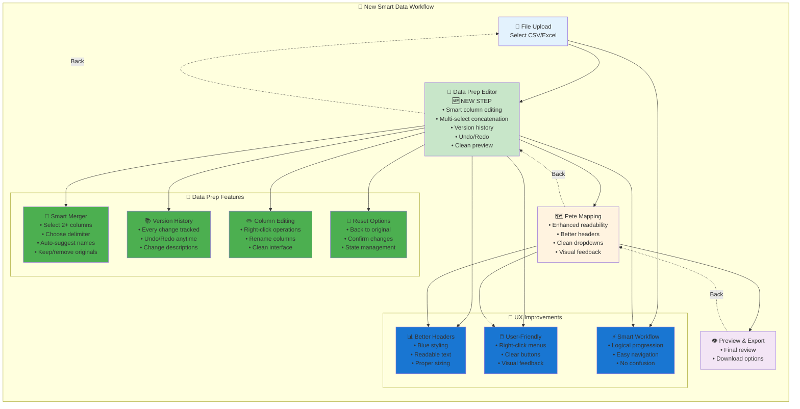

# 🔍 What's Working - Codebase Analysis Report

**Generated:** 2025-08-01 16:03:00
**Analyzed:** 53 Python files
**Total Lines of Code:** 7,932

---

## 📊 Summary Statistics

- **Files:** 53
- **Functions:** 399
- **Classes:** 47
- **Average LOC/File:** 149.7

### Files by Role:

- **Backend:** 14 files
- **CLI:** 3 files
- **Frontend:** 26 files
- **Test:** 1 files
- **Utility:** 9 files

---

## 🏗️ Architecture Overview

```mermaid
graph TB
    subgraph "🎯 Pete Codebase Architecture"
        subgraph "📊 📊 Development Tools (10 files)"
            node_0["hello.py<br/>📄 CLI<br/>📊 4 LOC"]
            node_1["auto_update_descriptions.py<br/>📄 Utility<br/>📊 89 LOC"]
            node_2["compare_rules.py<br/>📄 Utility<br/>📊 52 LOC"]
            node_3["fetch_and_save_rules.py<br/>📄 Utility<br/>📊 32 LOC"]
            node_4["fetch_rule.py<br/>📄 Utility<br/>📊 35 LOC"]
            node_5["fetch_rule_gh.py<br/>📄 Backend<br/>📊 66 LOC"]
            node_6["move_approved_rules.py<br/>📄 Utility<br/>📊 93 LOC"]
            node_7["readme_parser.py<br/>📄 Backend<br/>📊 51 LOC"]
            node_8["standardize_rules.py<br/>📄 Utility<br/>📊 46 LOC"]
            node_9["test_gui_workflow.py<br/>🧪 Test<br/>📊 56 LOC"]
        end
        subgraph "🔧 🔧 Backend (5 files)"
            node_10["__init__.py<br/>📄 Backend<br/>📊 0 LOC"]
            node_11["data_standardizer.py<br/>🔄 Backend<br/>📊 13 LOC"]
            node_12["header_mapper.py<br/>📄 Backend<br/>📊 59 LOC"]
            node_13["sheets_client.py<br/>📡 Backend<br/>📊 173 LOC"]
            node_14["sheets_workspace_cli.py<br/>🚪 Backend<br/>📊 117 LOC"]
        end
        subgraph "⚙️ Backend Utils (7 files)"
            node_15["__init__.py<br/>📄 Backend<br/>📊 0 LOC"]
            node_16["architecture_renderer.py<br/>📄 Backend<br/>📊 203 LOC"]
            node_17["data_standardizer.py<br/>🔄 Backend<br/>📊 196 LOC"]
            node_18["data_type_converter.py<br/>📄 Backend<br/>📊 154 LOC"]
            node_19["frontend_analyzer.py<br/>📊 Backend<br/>📊 343 LOC"]
            node_20["phone_processor.py<br/>📄 Backend<br/>📊 312 LOC"]
            node_21["whatsworking.py<br/>📄 Backend<br/>📊 662 LOC"]
        end
        subgraph "🚪 🚪 Entry Points (2 files)"
            node_22["cli.py<br/>🚪 CLI<br/>📊 63 LOC"]
            node_23["config.py<br/>⚙️ Utility<br/>📊 7 LOC"]
        end
        subgraph "🎨 🎨 Frontend (11 files)"
            node_24["__init__.py<br/>📄 Frontend<br/>📊 2 LOC"]
            node_25["_deprecated_gui_mapping_tool.py<br/>🗺️ Frontend<br/>📊 1084 LOC"]
            node_26["constants.py<br/>📄 Frontend<br/>📊 27 LOC"]
            node_27["__init__.py<br/>📄 Frontend<br/>📊 15 LOC"]
            node_28["column_manager.py<br/>📄 Frontend<br/>📊 123 LOC"]
            node_29["concatenation_dialog.py<br/>💬 Frontend<br/>📊 248 LOC"]
            node_30["editor.py<br/>📄 Frontend<br/>📊 576 LOC"]
            node_31["version_manager.py<br/>📄 Frontend<br/>📊 73 LOC"]
            node_32["main_window.py<br/>🖼️ Frontend<br/>📊 239 LOC"]
            node_33["__init__.py<br/>📄 Frontend<br/>📊 7 LOC"]
            more_node_34["... and 1 more files"]
        end
        subgraph "🧩 Components (8 files)"
            node_35["__init__.py<br/>📄 Frontend<br/>📊 25 LOC"]
            node_36["_deprecated_data_prep_editor.py<br/>📄 Frontend<br/>📊 767 LOC"]
            node_37["base_component.py<br/>📦 Frontend<br/>📊 51 LOC"]
            node_38["file_selector.py<br/>📄 Frontend<br/>📊 185 LOC"]
            node_39["mapping_table_widget.py<br/>🗺️ Frontend<br/>📊 99 LOC"]
            node_40["mapping_ui.py<br/>🗺️ Frontend<br/>📊 274 LOC"]
            node_41["standardized_preview_ui.py<br/>📄 Frontend<br/>📊 151 LOC"]
            node_42["startup_menu.py<br/>📄 Frontend<br/>📊 55 LOC"]
        end
        subgraph "🔧 Dialogs (6 files)"
            node_43["__init__.py<br/>📄 Frontend<br/>📊 22 LOC"]
            node_44["concatenation_dialog.py<br/>💬 Frontend<br/>📊 106 LOC"]
            node_45["duplicate_removal_dialog.py<br/>💬 Frontend<br/>📊 180 LOC"]
            node_46["rename_column_dialog.py<br/>💬 Frontend<br/>📊 73 LOC"]
            node_47["rule_mapping_dialog.py<br/>🗺️ Frontend<br/>📊 160 LOC"]
            node_48["settings_dialog.py<br/>⚙️ Frontend<br/>📊 113 LOC"]
        end
        subgraph "🛠️ Frontend Utils (1 files)"
            node_49["logo_utils.py<br/>🛠️ Frontend<br/>📊 21 LOC"]
        end
        subgraph "📁 Other (3 files)"
            node_50["hello.py<br/>📄 CLI<br/>📊 4 LOC"]
            node_51["run_gas_function.py<br/>📄 Utility<br/>📊 30 LOC"]
            node_52["update_gas.py<br/>📄 Utility<br/>📊 48 LOC"]
        end
    end

    %% Key relationships
    node_1 --> node_2
    node_3 --> node_7
    node_12 --> node_10
    node_14 --> node_10
    node_17 --> node_2
    node_17 --> node_10
    node_20 --> node_2
    node_21 --> node_2
    node_24 --> node_32
    node_25 --> node_2
    node_25 --> node_10
    node_35 --> node_37
    node_35 --> node_39
    node_35 --> node_38
    node_35 --> node_36
    node_35 --> node_41
    node_35 --> node_40
    node_35 --> node_42
    node_36 --> node_19
    node_37 --> node_19

    %% Styling
    style node_0 fill:#96ceb4
    style node_1 fill:#96ceb4
    style node_2 fill:#96ceb4
    style node_3 fill:#96ceb4
    style node_4 fill:#96ceb4
    style node_5 fill:#96ceb4
    style node_6 fill:#96ceb4
    style node_7 fill:#96ceb4
    style node_8 fill:#96ceb4
    style node_9 fill:#96ceb4
    style node_10 fill:#ff6b6b
    style node_11 fill:#ff6b6b
    style node_12 fill:#ff6b6b
    style node_13 fill:#ff6b6b
    style node_14 fill:#ff6b6b
    style node_15 fill:#ff6b6b
    style node_16 fill:#ff6b6b
    style node_17 fill:#ff6b6b
    style node_18 fill:#ff6b6b
    style node_19 fill:#ff6b6b
    style node_20 fill:#ff6b6b
    style node_21 fill:#ff6b6b
    style node_22 fill:#45b7d1
    style node_23 fill:#45b7d1
    style node_24 fill:#4ecdc4
    style node_25 fill:#4ecdc4
    style node_26 fill:#4ecdc4
    style node_27 fill:#4ecdc4
    style node_28 fill:#4ecdc4
    style node_29 fill:#4ecdc4
    style node_30 fill:#4ecdc4
    style node_31 fill:#4ecdc4
    style node_32 fill:#4ecdc4
    style node_33 fill:#4ecdc4
    style node_35 fill:#4ecdc4
    style node_36 fill:#4ecdc4
    style node_37 fill:#4ecdc4
    style node_38 fill:#4ecdc4
    style node_39 fill:#4ecdc4
    style node_40 fill:#4ecdc4
    style node_41 fill:#4ecdc4
    style node_42 fill:#4ecdc4
    style node_43 fill:#4ecdc4
    style node_44 fill:#4ecdc4
    style node_45 fill:#4ecdc4
    style node_46 fill:#4ecdc4
    style node_47 fill:#4ecdc4
    style node_48 fill:#4ecdc4
    style node_49 fill:#4ecdc4
```

---

## 🎯 Smart Data Workflow

The application implements a user-friendly data processing workflow:

### Key Workflow Features:

- **📝 Data Preparation Editor**: New smart editor for preparing data before Pete mapping
- **🔗 Multi-Column Concatenation**: Select multiple columns and merge with custom delimiters
- **📚 Version History**: Full undo/redo with change tracking
- **🎨 Enhanced UI**: Better readability, clear headers, intuitive navigation
- **⚡ Logical Flow**: Upload → Prepare → Map → Export

---

## 🧮 Most Complex Files

| File | Complexity Score |
|------|------------------|
| `frontend/_deprecated_gui_mapping_tool.py` | 569 |
| `frontend/components/_deprecated_data_prep_editor.py` | 346 |
| `frontend/data_prep/editor.py` | 261 |
| `backend/utils/whatsworking.py` | 169 |
| `frontend/toolsui/data_tools_panel.py` | 152 |

---

## 🔗 Most Connected Files

| File | Import Count |
|------|--------------|
| `backend/utils/data_standardizer.py` | 11 |
| `backend/utils/whatsworking.py` | 10 |
| `frontend/_deprecated_gui_mapping_tool.py` | 9 |
| `backend/sheets_client.py` | 8 |
| `backend/utils/frontend_analyzer.py` | 8 |

---

## 📋 Detailed File Analysis

### Backend Files (14)

#### 📄 `DEV_MAN/rules_fetcher/fetch_rule_gh.py`
**Lines:** 66 | **Complexity:** 20
- **External Imports:** loguru, os, pandas, requests, subprocess
- **Functions:** get_repo_file_list, find_rule_paths, fetch_and_save_rule, main
- **Special:** 🚪 Entry Point

#### 📄 `DEV_MAN/rules_fetcher/readme_parser.py`
**Lines:** 51 | **Complexity:** 13
- **External Imports:** loguru, lxml, markdown, requests
- **Functions:** download_readme, parse_rules_from_readme, get_rule_links

#### 📄 `backend/__init__.py`
**Lines:** 0 | **Complexity:** 0
- **Special:** 📦 Init File

#### 📄 `backend/data_standardizer.py`
**Lines:** 13 | **Complexity:** 3
- **External Imports:** typing
- **Classes:** DataStandardizer
- **Functions:** __init__

#### 📄 `backend/header_mapper.py`
**Lines:** 59 | **Complexity:** 26
- **External Imports:** click, json, os, rapidfuzz, rich
- **Local Imports:** backend
- **Functions:** map_headers

#### 📄 `backend/sheets_client.py`
**Lines:** 173 | **Complexity:** 58
- **External Imports:** datetime, gspread, json, loguru, oauth2client, os, pickle, typing
- **Classes:** SheetsClient
- **Functions:** __init__, _authenticate, set_sheet_id, _get_spreadsheet, get_sheet_names (+8 more)
- **Decorators:** staticmethod

#### 📄 `backend/sheets_workspace_cli.py`
**Lines:** 117 | **Complexity:** 54
- **External Imports:** click, google, googleapiclient, json, os, rich
- **Local Imports:** backend
- **Functions:** cli, list, search, add, select (+1 more)

#### 📄 `backend/utils/__init__.py`
**Lines:** 0 | **Complexity:** 0
- **Special:** 📦 Init File

#### 📄 `backend/utils/architecture_renderer.py`
**Lines:** 203 | **Complexity:** 55
- **External Imports:** json, os, pathlib, typing
- **Classes:** ArchitectureRenderer
- **Functions:** main, __init__, _load_architecture_data, render_mermaid_from_json, render_summary (+4 more)
- **Special:** 🚪 Entry Point

#### 📄 `backend/utils/data_standardizer.py`
**Lines:** 196 | **Complexity:** 58
- **External Imports:** datetime, json, loguru, numpy, os, pandas, rapidfuzz, re, rich, typing
- **Local Imports:** backend
- **Classes:** DataStandardizer
- **Functions:** __init__, load_pete_headers_from_sheet, load_upload_file, load_rules, propose_mapping (+2 more)
- **Decorators:** staticmethod

#### 📄 `backend/utils/data_type_converter.py`
**Lines:** 154 | **Complexity:** 35
- **External Imports:** loguru, numpy, pandas, typing
- **Classes:** DataTypeConverter
- **Functions:** infer_type, convert_column, convert_dataframe, filter_empty_columns, suggest_column_types (+1 more)
- **Decorators:** staticmethod

#### 📄 `backend/utils/frontend_analyzer.py`
**Lines:** 343 | **Complexity:** 103
- **External Imports:** ast, collections, dataclasses, datetime, json, os, pathlib, typing
- **Classes:** ComponentAnalysis, FrontendAnalyzer
- **Functions:** main, __init__, analyze_component, _classify_component_type, analyze_frontend (+2 more)
- **Special:** 🚪 Entry Point

#### 📄 `backend/utils/phone_processor.py`
**Lines:** 312 | **Complexity:** 97
- **External Imports:** dataclasses, enum, loguru, numpy, pandas, re, typing
- **Classes:** PhoneStatus, PhoneType, PhoneEntry, PhoneProcessor
- **Functions:** clean_phone_dataframe, clean_single_phone, __init__, clean_phone_number, detect_phone_status (+6 more)

#### 📄 `backend/utils/whatsworking.py`
**Lines:** 662 | **Complexity:** 169
- **External Imports:** ast, collections, dataclasses, datetime, fnmatch, json, os, pathlib, re, typing
- **Classes:** FileAnalysis, ArchitectureDiagramGenerator, CodebaseAnalyzer
- **Functions:** main, __init__, _load_config, _get_default_config, _matches_pattern (+14 more)
- **Special:** 🚪 Entry Point

### CLI Files (3)

#### 📄 `DEV_MAN/hello.py`
**Lines:** 4 | **Complexity:** 1
- **Functions:** main
- **Special:** 🚪 Entry Point

#### 📄 `cli.py`
**Lines:** 63 | **Complexity:** 6
- **External Imports:** click, os, rich, subprocess, sys
- **Functions:** cli, workspace, standardize
- **Decorators:** pass_context

#### 📄 `hello.py`
**Lines:** 4 | **Complexity:** 1
- **Functions:** main
- **Special:** 🚪 Entry Point

### Frontend Files (26)

#### 📄 `frontend/__init__.py`
**Lines:** 2 | **Complexity:** 0
- **Local Imports:** main_window
- **Special:** 📦 Init File

#### 📄 `frontend/_deprecated_gui_mapping_tool.py`
**Lines:** 1084 | **Complexity:** 569
- **External Imports:** PyQt5, loguru, os, pandas, re, shutil, sys, typing
- **Local Imports:** backend
- **Classes:** SettingsDialog, StartupMenu, FileSelector, RuleMappingDialog, ConcatenationDialog, MappingTableWidget, ConcatenationDialog, RenameColumnDialog, MappingUI, StandardizedPreviewUI, MainWindow, WorkspaceDialog
- **Functions:** create_logo_label, __init__, save, __init__, handle_select (+54 more)

#### 📄 `frontend/components/__init__.py`
**Lines:** 25 | **Complexity:** 0
- **External Imports:** data_prep
- **Local Imports:** base_component, file_selector, mapping_table_widget, mapping_ui, standardized_preview_ui, startup_menu
- **Special:** 📦 Init File

#### 📄 `frontend/components/_deprecated_data_prep_editor.py`
**Lines:** 767 | **Complexity:** 346
- **External Imports:** PyQt5, copy, json, os, pandas, typing
- **Local Imports:** frontend
- **Classes:** DataVersionManager, SmartConcatenationDialog, DataPrepEditor
- **Functions:** __init__, save_version, get_current_data, can_undo, can_redo (+30 more)

#### 📄 `frontend/components/base_component.py`
**Lines:** 51 | **Complexity:** 22
- **External Imports:** PyQt5
- **Local Imports:** frontend
- **Classes:** BaseComponent
- **Functions:** __init__, _add_navigation_buttons, _handle_back, _handle_exit

#### 📄 `frontend/components/file_selector.py`
**Lines:** 185 | **Complexity:** 77
- **External Imports:** PyQt5, loguru, os, pandas, shutil, typing
- **Local Imports:** backend, frontend
- **Classes:** FileSelector
- **Functions:** __init__, _setup_ui, refresh_file_list, on_file_selected, upload_new_csv (+4 more)

#### 📄 `frontend/components/mapping_table_widget.py`
**Lines:** 99 | **Complexity:** 47
- **External Imports:** PyQt5, typing
- **Local Imports:** frontend
- **Classes:** MappingTableWidget
- **Functions:** __init__, set_pete_headers, mousePressEvent, show_context_menu, open_concatenation_dialog (+3 more)

#### 📄 `frontend/components/mapping_ui.py`
**Lines:** 274 | **Complexity:** 103
- **External Imports:** PyQt5, pandas, typing
- **Local Imports:** backend, frontend
- **Classes:** MappingUI
- **Functions:** __init__, _setup_ui, toggle_headers, update_mapping_table, _setup_upload_view (+8 more)

#### 📄 `frontend/components/standardized_preview_ui.py`
**Lines:** 151 | **Complexity:** 63
- **External Imports:** PyQt5, pandas, typing
- **Local Imports:** frontend
- **Classes:** StandardizedPreviewUI
- **Functions:** __init__, _setup_ui, _setup_preview_table, _setup_download_buttons, download_csv (+3 more)

#### 📄 `frontend/components/startup_menu.py`
**Lines:** 55 | **Complexity:** 23
- **External Imports:** PyQt5, typing
- **Local Imports:** frontend
- **Classes:** StartupMenu
- **Functions:** __init__, _setup_ui, handle_select, update_options

#### 📄 `frontend/constants.py`
**Lines:** 27 | **Complexity:** 0
- **External Imports:** os

#### 📄 `frontend/data_prep/__init__.py`
**Lines:** 15 | **Complexity:** 0
- **Local Imports:** column_manager, concatenation_dialog, editor, version_manager
- **Special:** 📦 Init File

#### 📄 `frontend/data_prep/column_manager.py`
**Lines:** 123 | **Complexity:** 70
- **External Imports:** PyQt5, json, os, pandas, typing
- **Classes:** ColumnHidingManager
- **Functions:** __init__, _load_never_map_rules, is_hidden, is_never_map, hide_columns (+10 more)

#### 📄 `frontend/data_prep/concatenation_dialog.py`
**Lines:** 248 | **Complexity:** 96
- **External Imports:** PyQt5, typing
- **Classes:** SmartConcatenationDialog
- **Functions:** __init__, _setup_ui, _generate_smart_names, _update_delimiter_preview, _on_delimiter_changed (+2 more)

#### 📄 `frontend/data_prep/editor.py`
**Lines:** 576 | **Complexity:** 261
- **External Imports:** PyQt5, pandas, typing
- **Local Imports:** column_manager, concatenation_dialog, frontend, version_manager
- **Classes:** DataPrepEditor
- **Functions:** __init__, _setup_ui, _create_data_panel, _create_data_controls, _create_visibility_controls (+24 more)

#### 📄 `frontend/data_prep/version_manager.py`
**Lines:** 73 | **Complexity:** 35
- **External Imports:** pandas, typing
- **Classes:** DataVersionManager
- **Functions:** __init__, save_version, get_current_data, can_undo, can_redo (+4 more)

#### 📄 `frontend/dialogs/__init__.py`
**Lines:** 22 | **Complexity:** 0
- **Local Imports:** concatenation_dialog, duplicate_removal_dialog, rename_column_dialog, rule_mapping_dialog, settings_dialog
- **Special:** 📦 Init File

#### 📄 `frontend/dialogs/concatenation_dialog.py`
**Lines:** 106 | **Complexity:** 58
- **External Imports:** PyQt5, typing
- **Classes:** ConcatenationDialog
- **Functions:** __init__, _setup_ui, _setup_source_selection, _setup_separator_input, _setup_destination_selection (+2 more)

#### 📄 `frontend/dialogs/duplicate_removal_dialog.py`
**Lines:** 180 | **Complexity:** 100
- **External Imports:** PyQt5, typing
- **Classes:** DuplicateRemovalDialog
- **Functions:** __init__, _setup_ui, _on_method_changed, _update_preview, _get_selected_columns (+2 more)

#### 📄 `frontend/dialogs/rename_column_dialog.py`
**Lines:** 73 | **Complexity:** 41
- **External Imports:** PyQt5
- **Classes:** RenameColumnDialog
- **Functions:** __init__, _setup_ui, validate_and_accept, get_new_name

#### 📄 `frontend/dialogs/rule_mapping_dialog.py`
**Lines:** 160 | **Complexity:** 78
- **External Imports:** PyQt5, typing
- **Classes:** RuleMappingDialog
- **Functions:** __init__, _setup_ui, _setup_never_map_tab, _setup_explicit_map_tab, _setup_concatenation_tab (+2 more)

#### 📄 `frontend/dialogs/settings_dialog.py`
**Lines:** 113 | **Complexity:** 75
- **External Imports:** PyQt5, typing
- **Classes:** SettingsDialog
- **Functions:** __init__, _setup_ui, _setup_mapping_settings, _setup_empty_column_settings, _setup_menu_options (+1 more)

#### 📄 `frontend/main_window.py`
**Lines:** 239 | **Complexity:** 111
- **External Imports:** PyQt5, loguru, os, pandas, sys
- **Local Imports:** backend, frontend
- **Classes:** MainWindow
- **Functions:** main, __init__, _setup_ui, clear_layout, show_startup_menu (+15 more)
- **Special:** 🚪 Entry Point | 🧪 Has Tests

#### 📄 `frontend/toolsui/__init__.py`
**Lines:** 7 | **Complexity:** 0
- **Local Imports:** data_tools_panel
- **Special:** 📦 Init File

#### 📄 `frontend/toolsui/data_tools_panel.py`
**Lines:** 348 | **Complexity:** 152
- **External Imports:** PyQt5, pandas, typing
- **Local Imports:** frontend
- **Classes:** DataToolsPanel
- **Functions:** __init__, _setup_ui, _create_tools_panel, _create_tool_group, _create_action_buttons (+22 more)

#### 📄 `frontend/utils/logo_utils.py`
**Lines:** 21 | **Complexity:** 5
- **External Imports:** PyQt5
- **Local Imports:** frontend
- **Functions:** create_logo_label

### Test Files (1)

#### 📄 `tests/test_gui_workflow.py`
**Lines:** 56 | **Complexity:** 36
- **External Imports:** PyQt5, os, pandas, sys, unittest
- **Local Imports:** backend, frontend
- **Classes:** TestGUIMappingWorkflow
- **Functions:** setUpClass, test_startup_menu_exists, test_file_selector_navigation, test_file_upload_and_preview, test_mapping_workflow (+1 more)
- **Decorators:** classmethod
- **Special:** 🧪 Has Tests

### Utility Files (9)

#### 📄 `DEV_MAN/rules_fetcher/auto_update_descriptions.py`
**Lines:** 89 | **Complexity:** 19
- **External Imports:** loguru, os, re
- **Functions:** infer_globs, update_description_and_globs, main
- **Special:** 🚪 Entry Point

#### 📄 `DEV_MAN/rules_fetcher/compare_rules.py`
**Lines:** 52 | **Complexity:** 16
- **External Imports:** collections, loguru, os
- **Functions:** read_rule_file, extract_key_points, compare_rules

#### 📄 `DEV_MAN/rules_fetcher/fetch_and_save_rules.py`
**Lines:** 32 | **Complexity:** 5
- **External Imports:** loguru, os, requests
- **Local Imports:** readme_parser
- **Functions:** fetch_and_save_rule, main
- **Special:** 🚪 Entry Point

#### 📄 `DEV_MAN/rules_fetcher/fetch_rule.py`
**Lines:** 35 | **Complexity:** 6
- **External Imports:** loguru, os, requests, sys
- **Functions:** fetch_rule

#### 📄 `DEV_MAN/rules_fetcher/move_approved_rules.py`
**Lines:** 93 | **Complexity:** 16
- **External Imports:** loguru, os, shutil, subprocess
- **Functions:** prompt_mode, prompt_approve, prompt_overwrite, preview_rule, move_rule (+1 more)
- **Special:** 🚪 Entry Point

#### 📄 `DEV_MAN/rules_fetcher/standardize_rules.py`
**Lines:** 46 | **Complexity:** 13
- **External Imports:** loguru, os
- **Functions:** has_modern_header, standardize_rule_file, main
- **Special:** 🚪 Entry Point

#### 📄 `config.py`
**Lines:** 7 | **Complexity:** 0

#### 📄 `run_gas_function.py`
**Lines:** 30 | **Complexity:** 8
- **External Imports:** dotenv, googleapiclient, os, pickle, sys
- **Local Imports:** config
- **Functions:** get_credentials, run_function

#### 📄 `update_gas.py`
**Lines:** 48 | **Complexity:** 10
- **External Imports:** dotenv, google_auth_oauthlib, googleapiclient, os, pickle
- **Local Imports:** config
- **Functions:** get_credentials, update_script

---

## 🔄 Dependency Relationships

- `DEV_MAN/rules_fetcher/fetch_and_save_rules.py` depends on: `DEV_MAN/rules_fetcher/readme_parser.py`
- `frontend/__init__.py` depends on: `frontend/main_window.py`
- `frontend/components/__init__.py` depends on: `frontend/components/base_component.py`, `frontend/components/mapping_table_widget.py`, `frontend/components/file_selector.py`, `frontend/components/standardized_preview_ui.py`, `frontend/components/mapping_ui.py`, `frontend/components/startup_menu.py`
- `frontend/data_prep/__init__.py` depends on: `frontend/data_prep/concatenation_dialog.py`, `frontend/components/_deprecated_data_prep_editor.py`, `frontend/data_prep/version_manager.py`, `frontend/data_prep/column_manager.py`
- `frontend/data_prep/editor.py` depends on: `frontend/data_prep/concatenation_dialog.py`, `frontend/data_prep/version_manager.py`, `frontend/data_prep/column_manager.py`
- `frontend/dialogs/__init__.py` depends on: `frontend/dialogs/duplicate_removal_dialog.py`, `frontend/dialogs/rename_column_dialog.py`, `frontend/dialogs/settings_dialog.py`, `frontend/dialogs/rule_mapping_dialog.py`, `frontend/data_prep/concatenation_dialog.py`
- `frontend/toolsui/__init__.py` depends on: `frontend/toolsui/data_tools_panel.py`
- `run_gas_function.py` depends on: `config.py`
- `update_gas.py` depends on: `config.py`

---

**Report generated by:** `backend/utils/whatsworking.py`
**Timestamp:** 2025-08-01 16:03:00
