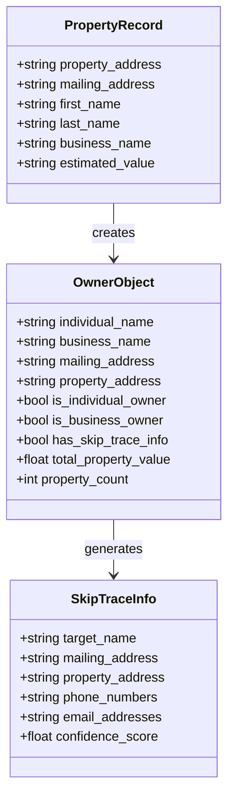
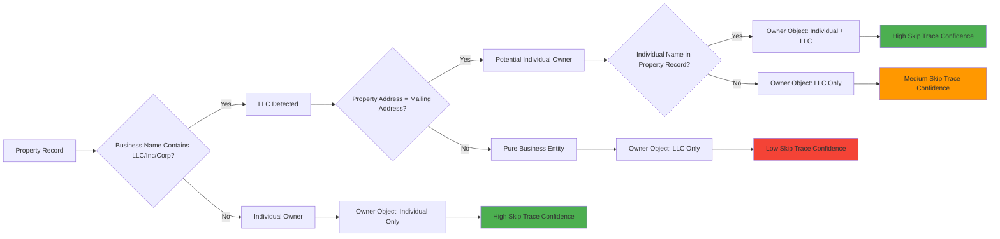
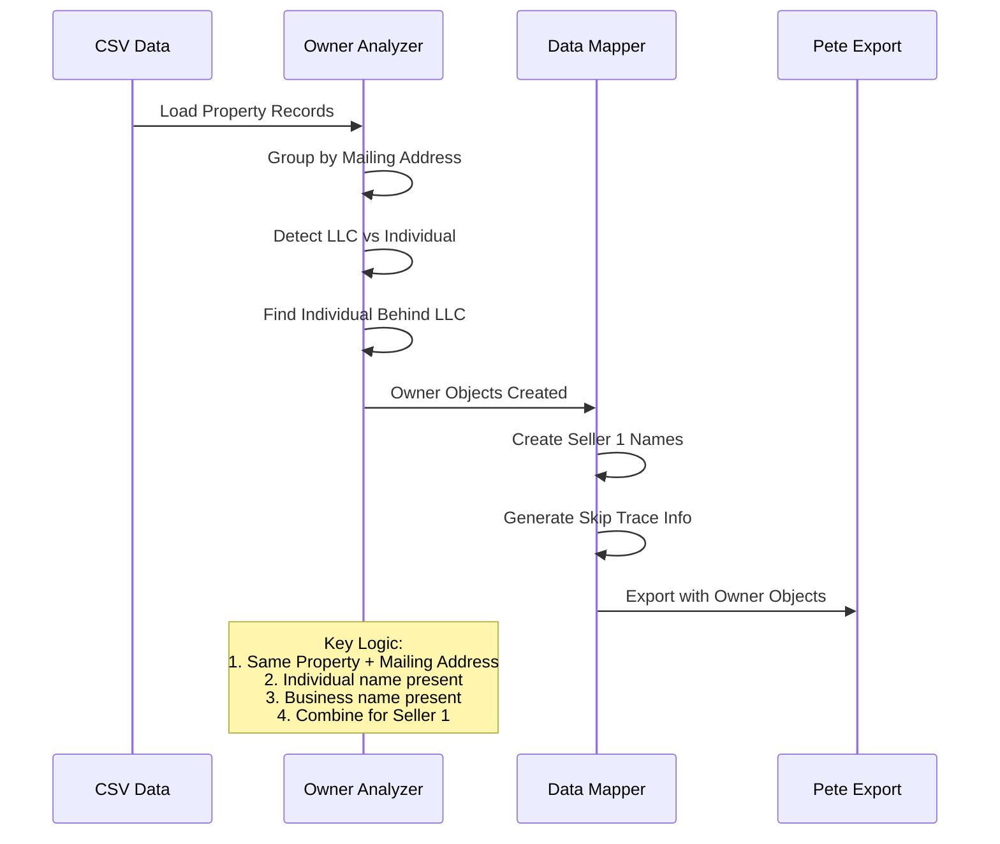
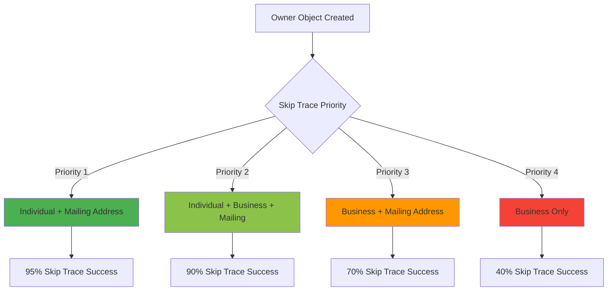

# 🏠 Owner Object Mapping Strategy

## Data Flow Diagram

```mermaid
graph TD
    A[Property Record] --> B[Extract Owner Info]
    B --> C{Owner Type?}

    C -->|Individual| D[Individual Owner Object]
    C -->|LLC/Business| E[Business Owner Object]

    D --> F[Seller 1: First Name + Last Name]

    E --> G[Business Name Analysis]
    G --> H{Find Individual Behind LLC?}

    H -->|Yes - Property Address = Mailing Address| I[Individual Owner Detected]
    H -->|No - Different Addresses| J[Business Only - No Individual]

    I --> K[Owner Object: Individual + Business]
    J --> L[Owner Object: Business Only]

    K --> M[Seller 1: Individual Name | Business Name]
    L --> N[Seller 1: Business Name Only]

    M --> O[Skip Trace: Individual Name + Mailing Address]
    N --> P[Skip Trace: Business Name + Mailing Address]

    style A fill:#e1f5fe
    style I fill:#c8e6c9
    style J fill:#ffcdd2
    style O fill:#4caf50
    style P fill:#ff9800
```

## Detailed Owner Object Structure



## LLC Detection & Individual Mapping Logic



## Data Processing Pipeline



## Skip Trace Priority Matrix



## Example Owner Object Mapping

### Scenario 1: Individual Behind LLC

```
Property Address: 123 Main St, Miami, FL
Mailing Address: 123 Main St, Miami, FL  ← SAME ADDRESS
First Name: John
Last Name: Smith
Business Name: ABC Properties LLC

→ Owner Object:
   Individual Name: "John Smith"
   Business Name: "ABC Properties LLC"
   Skip Trace Target: "John Smith" + "123 Main St, Miami, FL"
   Seller 1: "John Smith | ABC Properties LLC"
   Confidence: HIGH (95%)
```

### Scenario 2: Pure Business Entity

```
Property Address: 456 Oak Ave, Miami, FL
Mailing Address: 789 Business Blvd, Miami, FL  ← DIFFERENT ADDRESS
First Name: (empty)
Last Name: (empty)
Business Name: XYZ Holdings LLC

→ Owner Object:
   Individual Name: (empty)
   Business Name: "XYZ Holdings LLC"
   Skip Trace Target: "XYZ Holdings LLC" + "789 Business Blvd, Miami, FL"
   Seller 1: "XYZ Holdings LLC"
   Confidence: MEDIUM (70%)
```

### Scenario 3: Individual Owner

```
Property Address: 321 Pine St, Miami, FL
Mailing Address: 321 Pine St, Miami, FL  ← SAME ADDRESS
First Name: Mary
Last Name: Johnson
Business Name: (empty)

→ Owner Object:
   Individual Name: "Mary Johnson"
   Business Name: (empty)
   Skip Trace Target: "Mary Johnson" + "321 Pine St, Miami, FL"
   Seller 1: "Mary Johnson"
   Confidence: HIGH (95%)
```
